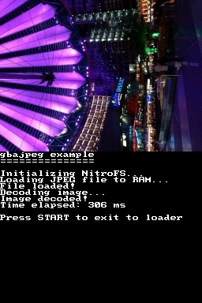

## 1. Introduction

We have seen how to use NitroFS to be able to go over the limits of the RAM
available in the DS. NitroFS is super useful for graphics and music for a game,
for example, because it tends to be pre-converted for extra speed. However, what
if you want to let the user provide files that your application needs to use?
For example, what if you want to support user avatars? You could tell the user
to add a PNG file to the SD card, next to the homebrew ROM, and load it. Also,
what about saving game data? NitroFS is read-only.

In order to support that kind of scenarios (and many more) there is code in
BlocksDS to allow you to access the following filesystems:

- The SD card of your flashcart (Slot-1 or Slot-2). The only requirement is that
  it has a DLDI driver.

- The SD card slot of the DSi.

It's also possible to access the internal NAND storage of the DSi, but this is
heavily discouraged. Use the SD cards unless you have a very good reason to use
the NAND.

All the filesystems mentioned before are formatted as FAT. BlocksDS doesn't
implement its own FAT driver due to the amount of effort it takes to do it.
Instead, it uses [ChaN's FatFs](http://elm-chan.org/fsw/ff/), which is widely
used in all sorts of projects (even commercial products), so it's very
well-tested.

## 2. DLDI

[DLDI](https://www.chishm.com/DLDI/) stands for "Dynamically Linked Device
Interface". It is a system that Nintendo DS homebrew applications use to be able
to read and write data from the SD card of flashcarts.

Essentially, the application contains a filesystem driver with some "read" and
"write" functions that are empty. When you load the ROM, the loader patches the
empty functions by the ones corresponding to your flashcart. That way one single
ROM can work in all flashcarts without actually needing to contain all drivers
of all flashcarts.

Most flashcarts autopatch NDS ROMs with the right DLDI driver, but some (the
very old ones) don't do it automatically, and they force the user to do it
manually. BlocksDS comes with `dldipatch`, which you can use to patch your ROMs.
Check [this archive](https://github.com/DS-Homebrew/DLDI) and look for your
flashcart, then use `dldipatch` like this:

```sh
$BLOCKSDS/tools/dldipatch/dldipatch patch dldi_driver.dldi rom.nds
```

It's very unlikely you will ever need to do this, but keep it in mind of you
find issues later when initializing the filesystems.

## 3. Initializing the filesystems

Before you can access any file you need to initialize the filesystems. The usual
way to do this is to put something like this at the beginning of your
application:

```c
#include <fat.h>

int main(int argc, char *argv[])
{
    bool init_ok = fatInitDefault();
    if (!init_ok)
    {
        // Handle error
    }

    // You can initialize NitroFS now if you want
    // init_ok = nitroFSInit(NULL);
    // ...

    // Rest of the code
}
```

In DS consoles this will try to initialize the DLDI driver. If that fails,
`fatInitDefault()` will return `false`.

In DSi consoles it tries to initialize the DLDI driver, the internal SD slot
and the internal NAND memory (NAND is initialized in read-only mode to prevent
accidental writes). It will only return `false` if the filesystem where the ROM
is located can't be initialized. For example, if your ROM is in the internal SD
slot, but it can't be initialized, it will return `false` even if the other
filesystems can be initialized.

If you want more information about possible failures, you can use `errno`:

```c
#include <errno.h>
#include <stdio.h>

#include <fat.h>

int main(int argc, char *argv[])
{
    bool init_ok = fatInitDefault();
    if (!init_ok)
    {
        // Handle error

        consoleDemoInit();

        // perror() uses the value of errno to print an error message. The
        // string passed to perror() is added to the error message. A common
        // approach is to pass the name of the function that has failed.
        perror("fatInitDefault");

        // You can also do something like this:
        printf("fatInitDefault() failed: %d", errno);

        while (1)
            swiWaitForVBlank();
    }

    // You can initialize NitroFS now if you want (and use errno or perror())
    // init_ok = nitroFSInit(NULL);
    // ...

    // Rest of the code
}
```

All the filesystem functions in BlocksDS set `errno` to values in a way that is
as close as possible to Linux and similar operative systems. However, there may
be situations in which the error codes of FatFs don't translate directly to the
right `errno` value.

Finally, you can also use `nandInit()` to initialize NAND. This is only required
if you want to enable write access to it (if not, `fatInitDefault()` is enough).
To disable read-only mode, call `nandInit(false)`. You should check for errors
the same way as with `fatInitDefault()` and `nitroFSInit()`.

## 4. Accessing the filesystems

When you initialize multiple filesystems it's important to know what's the
default filesystem. For example, if you call `fopen("file.txt", "rb")` it will
try to open the file in the current working directory, not in the root of the
filesystem.

In DS mode, `fatInitDefault()` sets DLDI as the main filesystem. In DSi mode,
the internal SD slot, DLDI or NAND depending on where your ROM is stored.

If you call `nitroFSInit()` it will set NitroFS as default.

`nandInit()` never changes the default filesystem.

The filesystems can be accessed with the following drive names:

- `"fat:/"`: DLDI drive (slot-1 or slot-2 flashcart).
- `"sd:/"`: Internal SD of the DSi.
- `"nand:/"`: Main partition of the NAND of DSi.
- `"nand2:/"`: Second partition of the NAND of DSi (used to store photos).
- `"nitro:/"`: NitroFS.

If you want to manually check if one specific filesystem is available you can do
it this way:

```c
#include <unistd.h>

int main(int argc, char *argv[])
{
    // ...

    if (access("sd:/", F_OK) != 0)
    {
        // We can't access the internal SD slot
    }

    // ...
}
```

You can freely switch the current working directory using `chdir()`:

```c
#include <stdio.h>
#include <unistd.h>

int main(int argc, char *argv[])
{
    // ...

    if (chdir("sd:/data/mygame") != 0)
    {
        // We can't switch to that directory
    }

    // This will open "sd:/data/mygame/save.bin"
    FILE *f = fopen("save.bin", "rb");

    // ...
}
```

If you want to know the location of the NDS ROM you can check `argv[0]`. This
relies on having a loader that provides the application with that information,
of course:

```c
#include <stdio.h>

int main(int argc, char *argv[])
{
    consoleDemoInit();

    for (int i = 0; i < argc; i++)
        printf("argv[%d] = %s\n", i, argv[i]);

    while (1)
        swiWaitForVBlank();
}
```

But what if you just want to use `chdir()` to set the working directory to the
directory that stores the NDS ROM? There are two additional helpers provided by
libnds:

- `fatGetDefaultDrive()` returns a `const char *` that will contain `"fat:/` in
  a DS. In DSi it may contain `"fat:/"`, `"sd:/"` or `"nand:/"` depending on
  where your ROM is located.

  Important: This pointer must not be passed to `free()`.

- `fatGetDefaultCwd()` returns a `char *` that contains the path to the folder
  that contains the NDS ROM (excluding the name of the ROM). If your ROM is
  located in `sd:/folder/file.nds` it will return `sd:/folder/`. If `argv[0]`
  isn't provided it will return the same value as `fatGetDefaultDrive()`.

  Important: Remember to call `free()` to free the memory used by this string
  after you have used it.

## 5. Example: Filesystem configuration for games

For example, if most of what you do is use NitroFS to load game graphics and
audio, but you sometimes write saved data to the same folder that contains your
ROM, you can do:

```
int main(int argc, char *argv[])
{
    bool init_ok = fatInitDefault();
    if (!init_ok)
    {
        // Handle error and hang
    }

    init_ok = nitroFSInit();
    if (!init_ok)
    {
        // Handle error and hang
    }

    // Set NitroFS as the default filesystem
    if (chdir("nitro:/");

    FILE *f = fopen("background/data.bin", "rb");

    // Load game data

    // ...

    // When you want to save data

    char *cwd = fatGetDefaultCwd();
    char path[512];
    snprintf(path, sizeof(path), "%s/savedata.bin", cwd);
    FILE *fout = fopen(path, "wb");
    free(cwd);

    // Now you can write data to fout
}
```

## 6. Example: Writing save data to the filesystem

BlocksDS comes with an example of a very basic save data system:
[`examples/filesystem/save_data`](https://github.com/blocksds/sdk/tree/master/examples/filesystem/save_data).

The idea is to have a global struct with the information you want to be able to
save and restore from the filesystem. Then, you write/read the struct in one go.

```c
typedef struct {
    uint32_t key_press_count[15];
} game_state_t;

static game_state_t game_state;

static bool load_data(const char *path)
{
    FILE *f = fopen(path, "rb");
    if (f == NULL)
    {
        printf("Can't open file\n");
        return false;
    }

    if (fread(&game_state, sizeof(game_state), 1, f) != 1)
    {
        printf("Can't read file\n");
        return false;
    }

    if (fclose(f) != 0)
    {
        printf("Can't close file\n");
        return false;
    }

    return true;
}

static bool save_data(const char *path)
{
    FILE *f = fopen(path, "wb");
    if (f == NULL)
    {
        printf("Can't open file\n");
        return false;
    }

    if (fwrite(&game_state, sizeof(game_state), 1, f) != 1)
    {
        printf("Can't write file\n");
        return false;
    }

    if (fclose(f) != 0)
    {
        printf("Can't close file\n");
        return false;
    }

    return true;
}
```

This solution has several issues:

- It doesn't support different versions with different structures. If you update
  your application you will need to handle different (probably incompatible)
  versions of the structure.
- It doesn't support save data that may have a varying size. For example, in a
  city-building game the player may want to store one city or 20. It doesn't
  make sense to always save files with enough space for 20 cities!
- It won't work in big-endian machines. Anything bigger than a byte will be read
  incorrectly in big-endian machines because the DS is little-endian.
- Different compilers may use different padding in a struct. If your struct
  contains a `u32`, `u16` and `u8` the compiler will probably add a padding of a
  byte so that the full size is 8 bytes, which is a multiple of 4 (the size of a
  word on DS, which has a 32-bit CPU). Compilers for a 64-bit architecture may
  introduce different padding, for example.

In general, it's better to have a function that manually reads each field of the
file. It should be able to handle endianness, and it is free to add padding or
not according to your needs because you control every single byte that you read
and write, unlike with a struct, which the compiler controls.

## 7. Example: Loading JPG file from the filesystem

Something you can do is let the user provide additional files to your
application. For example, in a photo viewer you need the user to provide their
own files and you need to be able to open them and display them.



You could ask the user to convert them to one of the formats supported by the
DS, but that isn't very user-friendly. Normally you would let the user have
files in a common format, like JPG, and the application is in charge of reading
the file and converting it.

One of the packages you can install from the BlocksDS package manager is
`blocksds-gbajpeg`:

```sh
wf-pacman -Sy blocksds-gbajpeg
```

You can see the full example (including loading the file from the filesystem)
[here](https://github.com/blocksds/gbajpeg/tree/master/example). All you have to
do in your program is to load the whole JPG file to RAM and then call this
function:

```c
#include <gba-jpeg-decode.h>

uint16_t buffer[256 * 192];

int main(int argc, char *argv[])
{
    void *jpg_file = NULL;

    // Load all the file into a buffer in RAM and point jpg_file to it

    JPEG_DecompressImage(jpg_file, buffer, 256, 192);

    // Copy the contents of "buffer" to VRAM, for example
}
```

You will also need to add gbajpeg to the Makefile:

```
LIBS        := -lgbajpeg -lnds9 -lc
LIBDIRS     := $(BLOCKSDS)/libs/libnds \
               $(BLOCKSDSEXT)/gbajpeg
```

## 8. Third-party libraries

The examples shown before are just a small showcase of what you can do. There
are plenty of libraries you can use to load files in different formats. Most of
them will just work with BlocksDS because BlocksDS implements the most common C
library functions, which cross-platform libraries depend on.

This is a list of Some popular libraries you may be interested in:

- PNG file loaders:

  - [libpng](https://libpng.org/pub/png/libpng.html)
  - [LodePNG](https://lodev.org/lodepng/)

- JPG file loaders:

  - [jpeglib](https://jpeglib.readthedocs.io/en/latest/index.html)

- GIF file loaders:

  - [GIFLIB](https://giflib.sourceforge.net/)

- Multi-format image loaders:

  - [libplum](https://github.com/aaaaaa123456789/libplum)
  - [stb\_image](https://github.com/nothings/stb/blob/master/stb_image.h)

- Compression/Uncompression libraries:

  - [zlib](https://www.zlib.net/)

- Font loaders and renderers:

  - [FreeType](https://freetype.org/)
  - [stb\_truetype](https://github.com/nothings/stb/blob/master/stb_truetype.h)

This tutorial won't explain how to use any of them. You should check the
documentation, examples and tutorials of the libraries you want to use.

Wonderful Toolchain has packages with pre-built versions of FreeType, libpng
and zlib:

```
wf-pacman -Sy toolchain-gcc-arm-none-eabi-freetype
wf-pacman -Sy toolchain-gcc-arm-none-eabi-libpng16
wf-pacman -Sy toolchain-gcc-arm-none-eabi-zlib
```
