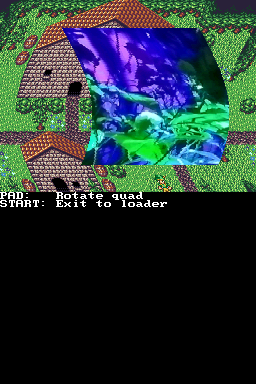

## 1. Introduction

The DS has many subsystems (video, audio, timers, etc), and they all generate
events that can be setup to interrupt the execution of code. For example, you
can setup a countdown timer so that when it reaches 0 the ARM9 stops doing
whatever it was doing, it jumps to a special routine created by you, and it
returns to the previous code after running that routine.

Of course, all you need to do is understand what kind of interrupts there are,
and how to assign your interrupt handling routines so that libnds uses them.
This is very easy, and you've been using interrupts already in a simplified way!

Previous chapters of this tutorial have used `swiWaitForVBlank()` to synchronize
the main loop with the screen refresh. Internally, libnds enables the vertical
blanking interrupt. This is an interrupt that happens whenever the screen has
finished drawing a frame. `swiWaitForVBlank()` simply waits for this to happen
and then it returns to your code.

Let's get into more interesting examples!

## 2. Basic example

We're going to setup an interrupt handler to be run when the screen has finished
being drawn and the vertical blanking period starts.

First, we need to understand how the screen is drawn. Every frame the hardware
starts sending pixels in horizontal lines from the top left. When the line is
complete, the screen controller enters "horizontal blanking period", in which no
pixels are sent to the screen. You're free to edit video settings during this
period. After a bit, the next line starts to be drawn. This process is repeated
until the last line is drawn, and then the screen controller enters "vertical
blanking period". This period lasts the same amount of time as several
horizontal lines. You can read a bit more about this
[here](https://gbadev.net/tonc/video.html#sec-blanks). You can read the timings
for a Nintendo DS in [GBATEK](https://problemkaputt.de/gbatek.htm#dsvideostuff).

This section is based on [`examples/interrupts/vbl_interrupt`](https://github.com/blocksds/sdk/tree/master/examples/interrupts/vbl_interrupt).

Note that the VBL interrupt is special because libnds enables it even before
`main()` is reached. We will see an example of another interrupt in the next
section. However, libnds already calls `irqEnable(IRQ_VBLANK)` before reaching
`main()`, so you don't need to do it.

```c
int irq_frame_count;

void vbl_handler(void)
{
    irq_frame_count++;
}

int main(int argc, char **argv)
{
    consoleDemoInit();
    irqSet(IRQ_VBLANK, vbl_handler);

    while (1)
    {
        swiWaitForVBlank();
        printf("%d\n", irq_frame_count);
    }
}
```

As you can see, all you need to do is call `irqSet()` from your code, specify an
interrupt handler, and say which interrupt type is the one you're interested in.
Each interrupt type can have one handler, and you can disable the handler by
calling `irqSet()` with a `NULL` interrupt handler.

In this example `vbl_handler()` will get called whenever the VBL interrupt
happens, interrupting the main loop. It will increase the counter and return to
the main loop. It will also allow `swiWaitForVBlank()` to finish.

It's important to consider that interrupt handlers usually can't be interrupted
themselves. One very important use for vertical blanking handlers is to copy
data to VRAM, update background scroll registers, update sprites, and generally
do any changes to the video output. However, be careful about this. If you spend
too much time copying data in this handler you may block other interrupts for
too long. Check the nested interrupts section below to see how to work around
this issue.

Note: Normally you don't need to worry about it because you'll focus on ARM9
code, but the ARM7 requires special handling regarding interrupts. You must call
`irqInit()` in your `main()` function if you want to use interrupts. The default
ARM7 cores do it almost as soon as `main()` starts. You can use their code as
[reference](https://github.com/blocksds/sdk/blob/a94e81627ab26e741f7d48d49a071f8d2785585f/sys/arm7/main_core/source/main.c#L85).

The ARM9 does this initialization in [`initSystem()`](https://github.com/blocksds/libnds/blob/01691665a5703a6c623421983df4e083de5d4f6e/source/arm9/system/initSystem.c#L64-L74),
which is called by the system initialization code before `main()`.

## 3. Hardware timers

Now we're going to see a more interesting example that involves hardware timers.

The DS has 4 hardware timers per CPU (4 for the ARM9, other 4 for the ARM7). The
timers can be setup in different modes (count up, count down) and they can even
be chained.

Most times you don't need the accuracy of a hardware timer. Your game loop can
be updated at the same rate as the screen refresh (using `swiWaitForVBlank()`)
and most other things have their own interrupts that happen at specific events
that require your attention. However, there are cases in which having an
accurate timer may be helpful. For example, if you're creating a music player,
you will need to use hardware timers to keep track of the audio that has payed
so far and how much you need to decode.

This section is based on [`examples/time/timers`](https://github.com/blocksds/sdk/tree/master/examples/time/timers).

```c
void timer0_handler(void)
{
    timer0_count++;
}

int main(int argc, char **argv)
{
    ...

    // Timer 0 will be called every second. This is a long time to wait, so a
    // big divider is required so that the timer counter can fit enough ticks to
    // count up to a second.
    timerStart(0, ClockDivider_1024, timerFreqToTicks_1024(1), timer0_handler);

    ...
}
```

This timer is setup to trigger an interrupt every second.

In this case, `timerStart()` sees that you're providing an IRQ handler
(`timer0_handler()`) and it calls `irqSet(IRQ_TIMER(0), timer0_handler)` and
`irqEnable(IRQ_TIMER(0))` internally.

The clock divider is the accuracy of the timer. The timer count value is a
16-bit value, which isn't that much. It can increase at different frequencies
that use the bus clock frequency (~33 MHz) as base, and then it's divided by a
divider that can be 1, 64, 256 or 1024. This means that the counter can increase
at a rate of 33 / 1 MHz, 33 / 64 MHz, 33 / 256 MHz, or 33 / 1024 MHz.

If you want the highest accuracy allowed by the hardware, you will need to use a
small divider, but you won't be able to count for a long time. If you want very
low accuracy (if you're counting seconds, for example), you can set a very high
divider, and you will be able to count for a long time.

The code is setting up a timer that has to cause an interrupt every second, so
we don't need a lot of accuracy. We can use a `ClockDivider_1024` value, and
then use `timerFreqToTicks_1024(1)` to generate the raw value that sets up the
timer to overflow once per second.

This other example is using a clock divider of 256 to setup a timer that fires
five times per second:

```c
void timer1_handler(void)
{
    timer1_count++;
}

int main(int argc, char **argv)
{
    ...

    // Timer 1 will be called five times per second. The total number of ticks
    // is smaller, so a smaller divider can be used.
    timerStart(1, ClockDivider_256, timerFreqToTicks_256(5), timer1_handler);

    ...
}

```

## 4. FPS counter

Now that we know how to setup a timer we can apply this to calculating the exact
FPS of an application.

This section is based on [`examples/interrupts/fps_counter`](https://github.com/blocksds/sdk/tree/master/examples/interrupts/fps_counter).

The idea behind a FPS counter is that you need a reliable way to measure time (a
hardware timer) because the main loop of your application may take longer than
expected to finish, so it may not be executed at a predictable frequency.

Essentially, we increase a counter in our main loop. This will give us the
number of frames that are actually drawn as they get drawn, even if some of them
are delayed.

Then, we setup a hardware timer to call a handler once per second. This function
is called exactly once per second, it can't be delayed. We can take a look at
how many frames have been drawn until that point and save it in a `fps`
variable:

```c
int fps;
int irq_frame_count;

void timer0_handler(void)
{
    fps = irq_frame_count;
    irq_frame_count = 0;
}

int main(int argc, char **argv)
{
    // Timer 0 will be called every second
    timerStart(0, ClockDivider_1024, timerFreqToTicks_1024(1), timer0_handler);

    consoleDemoInit();

    while (1)
    {
        irq_frame_count++;
        swiWaitForVBlank();

        printf("FPS: %d  ", fps);
    }
}
```

## 5. Interrupt types

There are several interrupt sources and they are different depending on the CPU.
Some useful interrupts for a developer are:

- `VBLANK`: Vertical blank mode has started.
- `HBLANK`: Horizontal blank mode has started. This is useful to change scroll
  registers or screen modes in between lines.
- `VCOUNT`: The current scanline being drawn matches the value in `REG_VCOUNT`.
  As opposed to the HBLANK interrupt, this one happens at the beginning of the
  line, not after it is drawn.
- `TIMER0` to `TIMER3`: Timer 0-3 has overflown.
- `DMA0` to `DMA3`: The DMA channel has finished a copy.
- `KEYS`: The specified key combination has been pressed.

There are some interrupts only available on the ARM9:

- `GEOMETRY_FIFO`: The GPU is now free to receive 3D commands.

And some are only available on the ARM7:

- `RTC`: Serial/RTC interrupts. Note that RTC interrupts aren't available on 3DS
  consoles in DS/DSi mode.
- `LID`: The lid has been opened.

For more information, check [GBATEK](https://problemkaputt.de/gbatek.htm#dsinterrupts).

## 6. Video effects using interrupts

We're going to see a practical example of how to use interrupts by creating a
wave effect with the HBL interrupt. This section of the tutorial is based on the
following example: [`examples/video_effects/hblank_scroll`](https://github.com/blocksds/sdk/tree/master/examples/video_effects/hblank_scroll).



For this effect we are going to use the horizontal blanking interrupt. This
interrupt is called after every line of the screen gets drawn. There's a bit of
time of wait between the drawing process of each line, so we can run some code
there to adjust the horizontal scroll of a background, for example, and we can
create nice effects that way. You can read `REG_VCOUNT` during the HBL handler
to see in which horizontal line you are and you can calculate the scroll based
on that information.

Note that the HBL interrupt is triggered after each line is drawn. This means
that you need to set the scroll of line 0 in some other way. In this example
we're using the VBL handler for that because we know it will be called after the
whole frame is drawn, and before the next frame starts getting drawn:

```c
static int angle_offset = 0;

static void vblank_handler(void)
{
    // Setup scroll for line 0 before it starts getting drawn.
    int32_t value = sinLerp(degreesToAngle(angle_offset + 0)) >> 7;
    REG_BG0HOFS = value;
}

static void hblank_handler(void)
{
    // Don't run during the VBL period
    if (REG_VCOUNT >= 192)
        return;

    // REG_VCOUNT always keeps the current line being drawn. However, this
    // interrupt handler only starts getting called after the first line is
    // drawn, so we need to fix the scroll of line 0 in the VBL handler.
    int32_t value = sinLerp(degreesToAngle(angle_offset + REG_VCOUNT + 1)) >> 7;
    REG_BG0HOFS = value;
}
```

When you're ready to enable the effect, call the following functions to setup
the interrupt handlers and enable the HBL interrupt (the VBL interrupt is
enabled by libnds by default):

```c
irqSet(IRQ_VBLANK, vblank_handler);
irqSet(IRQ_HBLANK, hblank_handler);
irqEnable(IRQ_HBLANK);
```

Unfortunately, this system requires a fair amount of CPU power. After each
scanline is drawn, the global interrupt handler is executed. It isn't a big
piece of code, and it runs from ITCM (so it is as fast as it can possibly be),
but it still needs a lot more time to get to the user interrupt handler
(`hblank_handler()` in the example), and that cost is paid every line. In the
DMA chapter we'll see a more convenient way of doing this.

## 7. Nested interrupts

As mentioned before, interrupt handlers can't be interrupted under normal
circumstances. Normally, your interrupt handlers should be small so that they
don't block the handling of other interrupts. However, this isn't possible in
all cases. For example, the vertical blanking interrupt handler may need to
copy new tiles to the background to animate some elements in the map. If you
have a timer interrupt that is called very frequently, it's possible that one of
the interrupts will have to wait for too long and break other part of the
program.

The way to fix this issue is to allow the interrupt handler to be interrupted.
Let's see an example:

```c
void vbl_handler(void)
{
    // Update background registers
    bgUpdate();

    // Update sprites
    oamUpdate(&oamMain);
    oamUpdate(&oamSub);

    // Allow interrupts from now on
    REG_IME = 1;

    // Copy background tiles
    swiCopy(...);
}

void timer0_handler(void)
{
    // Do something very fast
}

int main(int argc, char **argv)
{
    irqSet(IRQ_VBLANK, vbl_handler);

    // Timer 0 will be called 1000 times per second
    timerStart(0, ClockDivider_1, timerFreqToTicks_1(1000), timer0_handler);

    while (1)
    {
        swiWaitForVBlank();

        // ...
    }
}
```

In this example the VBL handler has two parts. The first part does some quick
actions like updating background registers and OAM, then enables nested
interrupts, and finally copies a lot of data to VRAM, which will take some time.

Note that even if you set `REG_IME` to 1 it will be set to 0 the next time any
interrupt handler is called.

Another important use of nested interrupts is audio mixing, but this isn't
something you normally need to worry about. If you're curious about it, Maxmod
is a good example of how it works:

The timer 0 interrupt handler is configured [here](https://github.com/blocksds/maxmod/blob/4a81f0d8182deaffe84823d7cce759c2de60b4ce/source/ds/arm7/mm_main7.c#L183-L184).
The implementation of the handler `mmFrame()` is [here](https://github.com/blocksds/maxmod/blob/4a81f0d8182deaffe84823d7cce759c2de60b4ce/source/ds/arm7/mm_main7.c#L216-L230):

```c
void mmFrame(void)
{
    if (mmIsInitialized())
    {
        mmMixerPre(); // critical timing
        REG_IME = 1;
        mmUpdateEffects(); // update sound effects
        mmPulse(); // update module playback
        mmMixerMix(); // update audio
        mmSendUpdateToARM9();
    }

    mmProcessComms();
}
```

You can see that `mmMixerPre()` is called right away, then interrupts are
enabled, and finally other functions are called. The difference between
`mmMixerPre()` and the others is that this particular function is in charge of
swapping the audio buffers played back by the hardware. This needs to be done at
exactly the right time or it will generate noticeable clicks in the audio
output. However, `mmMixerMix()` can be very CPU-intensive: it can be setup to do
audio mixing of several audio channels by software. It doesn't matter when it
finishes as long as it finishes before the next time `mmFrame()` is called.

Note that, in this case, the actual frequency of the timer is variable and it's
setup in other parts of the code. We won't get to that here because it's not
relevant for the handling of interrupts themselves.
