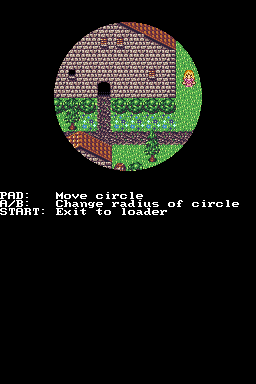

## 1. Introduction

Now that we know how to load graphics we can focus on some additional features
that can definitely help improve the quality of your 2D graphics. This chapter
will talk about some 2D graphics features we haven't discussed so far.

## 2. Master brightness registers

The DS lets you easily adjust the brightness of each screen with registers
`REG_MASTER_BRIGHT` and `REG_MASTER_BRIGHT_SUB`. You can configure each screen to
do a fade to white or black independently from the other one. This effect
affects the whole screen (2D and 3D output).

The registers are a bit annoying to use, so libnds comes with a helper to make
it easier:

```c
void setBrightness(int screen, int level);
```

You can see it in action in this example:
[`examples/video_effects/master_brightness`](https://github.com/blocksds/sdk/tree/master/examples/video_effects/master_brightness).

## 3. Regular windows

Windows are a way to define regions of the screen where background layers or
sprites are allowed to be drawn or not. There are two rectangular windows
(windows 0 and 1) and a third special window called "object window" that takes
the shape of sprites specified by the developer.

It may be hard to understand what they actually do without an example, so let's
start with the regular windows:


You can check the full source code of the example here:
[`examples/video_effects/regular_windows`](https://github.com/blocksds/sdk/tree/master/examples/video_effects/regular_windows).

As you can see, there are 3 different areas in the image. There's an inner
rectangle that doesn't display the map, an outer border that doesn't display it
either, and an intermediate region that shows the rectangle.

The rectangles correspond to the bounds of the windows. You can specify
horizontal and vertical bounds for the window. Without any special handling they
result in rectangles.

The effect of that demo is achieved by using windows 0 and 1:

```c
windowSetBounds(WINDOW_0, 48, 48, SCREEN_WIDTH - 48, SCREEN_HEIGHT - 48);
windowSetBounds(WINDOW_1, 16, 16, SCREEN_WIDTH - 16, SCREEN_HEIGHT - 16);

bgWindowDisable(bg, WINDOW_0);
bgWindowEnable(bg, WINDOW_1);
bgWindowDisable(bg, WINDOW_OUT);

windowEnable(WINDOW_0 | WINDOW_1);
```

Window 0 has priority over window 1. In this example, windows 0 is a small
rectangle in the center of the screen, and window 1 is a rectangle that covers
most of the screen.

- The outside of the big rectangle isn't inside window 1, so the background
  isn't visible.

- The inside of window 1 has enabled the display of the background, so it is
  visible.

- Windows 0 has disabled the background, and it takes priority over window 1,
  so it isn't visible inside.

You can control each one of the 4 background layers, all the sprites as a single
layer, and blending effects (which will be explained later).

Windows may not look impressive when used as rectangles, but you can achieve
very interesting effects if you combine this with HBL interrupts or
HBL-triggered DMA.



You can check the full source code of the example here:
[`examples/video_effects/circular_window`](https://github.com/blocksds/sdk/tree/master/examples/video_effects/circular_window).

What this example is doing is setting up DMA to be triggered every HBL and to
copy one single value to the `REG_WIN0H` register, which controls the left and
right bounds of window 0 (`windowSetBounds()` works by writing to this
register). By changing the values every scanline (with the same system we saw in
the chapter about DMA) you can create any shape you want, like a circle.

The example uses the mid-point circle generation algorithm to generate the
values written to the register.

## 4. Object window

Instead of defining a rectangular shape (or using tricks like the ones used to
create the circular window of the previous section) you can use any window shape
you want by using sprites. For example, you can use the following image as the
shape of the window:


And obtain the following effect:


You can check the full source code of the example here:
[`examples/video_effects/obj_windows`](https://github.com/blocksds/sdk/tree/master/examples/video_effects/obj_windows).

You are expected to load the sprite graphics as usual, except for the palette,
which can be ignored:

```c
// Allocate space for the tiles and copy them there
u16 *gfxMain = oamAllocateGfx(&oamMain, SpriteSize_64x64, SpriteColorFormat_256Color);
dmaCopy(statueTiles, gfxMain, statueTilesLen);

// No need to copy the palette, this sprite won't be displayed normally
//dmaCopy(statuePal, SPRITE_PALETTE, statuePalLen);

oamSet(&oamMain, 0,
       100, 50, // X, Y
       0, // Priority
       0, // Palette index (unused for window sprites)
       SpriteSize_64x64, SpriteColorFormat_256Color, // Size, format
       gfxMain,  // Graphics offset
       -1, // Affine index
       false, // Double size
       false, // Hide
       false, false, // H flip, V flip
       false); // Mosaic
```

Then, you need to mark the sprite as a window mask. Any pixel of the sprite with
a palette index different from 0 is considered part of the mask. Any pixel that
uses color index 0 isn't considered part of the mask:

```c
// Mark this sprite to be used as window mask
oamSetBlendMode(&oamMain, 0, SpriteMode_Windowed);
```

And last, you need to define the layers that are displayed inside the mask and
outside of it:

```c
// Disable display of the background everywhere but in the parts highlighted
// by the sprite.
bgWindowEnable(bg, WINDOW_OBJ);
bgWindowDisable(bg, WINDOW_OUT);
windowEnable(WINDOW_OBJ);
```

## 5. Blending

The 2D engines support some basic blending between 2D layers. There are two ways
to do it:

- Using the hardware registers `REG_BLDCNT`, `REG_BLDALPHA` and `REG_BLDY`. They
  let you select full layers to be blended with other layers. The 6 available
  layers are the 4 background layers, the sprites and the backdrop color. You
  can select any layers as source A and others as source B, and then specify the
  blending factor in `REG_BLDALPHA`.

  There are also other modes that `REG_BLDCNT` lets you select. In total, you
  can select fade to white, fade to black, alpha blending or nothing. Register
  `REG_BLDALPHA` lets you specify alpha blending settings. Register `REG_BLDY`
  lets you specify fade settings.

- Individually select sprites to be blended with individual per-sprite
  transparency settings. This mode overrides the blending mode specified in
  `REG_BLDCNT` for any sprite set to alpha blending mode. The values in
  `REG_BLDALPHA` will be used to setup the effect.

  It doesn't ignore any other fields of that register, like source and
  destination layers. It will enable alpha blending for the selected sprites
  even if `REG_BLDCNT` has specified a different effect or it has disabled it.
  If `REG_BLDCNT` has been setup to do a fade to white for sprites, any sprites
  set to alpha blending mode will use alpha blending and the rest will do fade
  to white.

Note: The effects can be restricted to one specific region of the screen by
using windows.

This example lets you play with the hardware registers that setup blending and
fade effects:

[`examples/video_effects/blending`](https://github.com/blocksds/sdk/tree/master/examples/video_effects/blending).


Setting up the effects is actually very easy.

For example, if you want to blend all sprites on top of background layer two and
the backdrop, set the priorities of your layers correctly (sprites must have a
higher priority than background layer two) and do this:

```c
REG_BLDCNT = BLEND_ALPHA
           | BLEND_SRC_SPRITE
           | BLEND_DST_BG2 | BLEND_DST_BACKDROP;

REG_BLDALPHA = BLDALPHA_EVA(eva) | BLDALPHA_EVB(evb);
```

When the hardware performs blending it takes the values of `eva` and `evb`
(between 0 and 16), does the following calculation for each R, G, B component,
and the result is clamped to a maximum value of 31:

```
((source * eva) + (destination * evb) / 16
```

This lets you adjust how transparent the layer is. Note that if `eva + evb` is
16 the result will be regular alpha blending. If the sum is greater than 16 the
result will be brighter than expected, giving the result a glowy effect. If the
sum is lower than 16, the result will be darker than expected.

If you don't want to do alpha blending but just a fade to white or black, do
something like this:

```c
REG_BLDCNT = BLEND_FADE_WHITE
           | BLEND_SRC_SPRITE
           | BLEND_DST_BG2 | BLEND_DST_BACKDROP;

REG_BLDY = BLDY_EVY(evy);
```

Similarly, `evy` ranges from 0 (no change) to 16 (fully white/black).

Finally, this is the way to enable alpha blending mode for individual sprites:

```
// Force alpha blending mode for sprite 1. This sprite will ignore the mode
// setting in REG_BLDCNT.
oamSetBlendMode(&oamMain, 1, SpriteMode_Blended);
```

## 6. Mosaic

This is the last effect to mention, and it's an unusual one. It simply makes
backgrounds or sprites "blockier". You need to specify a block size in pixels
(from 1x1 to 16x16) and it will pixelate the selected backgrounds and sprites to
that size.


This effect has been used in some games to simulate "digital" explosions (you
can increase the mosaic dimensions over a few frames and then delete the sprite,
for example).

You can check this example if you want to experiment with this effect:

[`examples/video_effects/mosaic`](https://github.com/blocksds/sdk/tree/master/examples/video_effects/mosaic).

Enabling this effect for backgrounds is easy:

```c
bgMosaicEnable(bg);
bgSetMosaic(horizontal_mosaic, vertical_mosaic);
```

You need to enable it in individual sprites (there is no global setting):

```c
oamSet(&oamMain, 1,
       150, 70, // X, Y
       0, // Priority
       0, // Palette index
       SpriteSize_64x64, SpriteColorFormat_256Color, // Size, format
       gfxMain, // Graphics offset
       -1, // Affine index
       false, // Double size
       false, // Hide
       false, false, // H flip, V flip
       true); // Mosaic: This needs to be set to true to enable mosaic!

// Set global setting for sprites
oamSetMosaic(horizontal_mosaic, vertical_mosaic);
```
