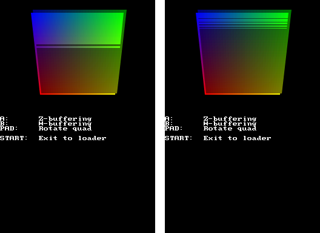
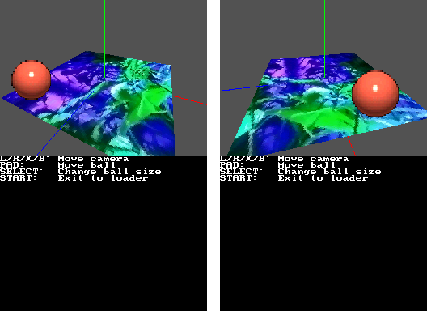
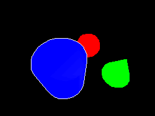

## 1. Introduction

This chapter is a continuation of the [3D graphics](../../intermediate/3d_graphics)
chapter that focuses on more advanced techniques.

## 2. W vs Z buffering

The DS allows you to pick between Z and W depth buffering. All you need to do is
to call `glFlush(GL_ZBUFFERING)` (the default if you don't specify anything) or
`glFlush(GL_WBUFFERING)` (not recommended for orthogonal projections).

Z-buffering distributes depth values uniformly between the near plane and the
far plane, so it works better when your polygons are distributed uniformly
between them. W-buffering is more accurate for polygons close to the near plane,
and less accurate for polygons close to the far plane. This may make it more
useful for regular 3D scenes.

The GPU uses fixed point for all its calculations, and it's easy to see
[Z-fighting](https://en.wikipedia.org/wiki/Z-fighting) between polygons that
don't have enough space between them. Having a bit more of accuracy can help
with this kind of issues. This image shows the same scene with Z-buffering on
the left and W-buffering on the right, and it proves how W-buffering is more
accurate in this specific case:



You can test the example yourself here:
[`examples/graphics_3d/depth_buffering_modes`](https://codeberg.org/blocksds/sdk/src/branch/master/examples/graphics_3d/depth_buffering_modes)

## 2. Billboards

Billboards are 2D objects that are displayed in a 3D scene, but always facing
the camera.



This can be done for different reasons:

- You want to display a 2D status bar on top of a character or enemy.
- You want to draw shapes that are hard to draw in 3D, like a sphere, but you
  don't want to use many polygons to do it. In this case, a 2D quad with a
  texture that displays a circle could be convincing enough for your players.

Displaying polygons that always face the camera requires you to know the
direction the camera is facing right now. We can do that by getting the vector
matrix. This is a 3x3 matrix that is transformed the same way as the position
and projection matrix, but with unit vectors.

From that matrix we can extract the three vectors that face up, right and front
from the perspective of the camera, and create a matrix that is the inverse of
it. The vector matrix has unit vectors, so we can invert it by transposing it:

```c
int matrix[9];
glGetFixed(GL_GET_MATRIX_VECTOR, matrix);

int32_t right[3] = { matrix[0], matrix[3], matrix[6] };
int32_t up[3] =    { matrix[1], matrix[4], matrix[7] };
int32_t front[3] = { matrix[2], matrix[5], matrix[8] };

// Create the inverse matrix of the vector matrix
const m3x3 to_billboard_space = {{
     right[0],  right[1],  right[2],
        up[0],     up[1],     up[2],
    -front[0], -front[1], -front[2],
}};
```

When we multiply the current modelview matrix by `to_billboard_space` we will
switch from using the 3D world axes to using axes aligned to the screen. For
example, if you're drawing a quad that represents a ball:

```c
glPushMatrix();

    // Move to the position of the ball first
    glTranslate3f32(ball.x, ball.y, ball.z);

    // Rotate the world so that the axes are in billboard space
    glMultMatrix3x3(&to_billboard_space);

    // Now we can scale the billboard if we want
    glScalef32(inttof32(ball.scale), inttof32(ball.scale), inttof32(1));

    glBegin(GL_QUADS);

        glTexCoord2t16(inttot16(32), 0);
        glVertex3v16(floattov16(-0.5), floattov16(1), 0);

        glTexCoord2t16(0, 0);
        glVertex3v16(floattov16(0.5), floattov16(1), 0);

        glTexCoord2t16(0, inttot16(32));
        glVertex3v16(floattov16(0.5), 0, 0);

        glTexCoord2t16(inttot16(32), inttot16(32));
        glVertex3v16(floattov16(-0.5), 0, 0);

    glEnd();

glPopMatrix(1);
```

You can check the example here:
[`examples/graphics_3d/billboards`](https://codeberg.org/blocksds/sdk/src/branch/master/examples/graphics_3d/billboards)

## 3. Knowing if a 3D object is touched

Knowing what 3D object is under a point of the screen can be useful. For
example, if you're pressing the touch screen, you may want to know which object
is being touched.

You can design your game in a way that makes it easier to convert from 2D
coordinates to the 3D world, but that doesn't work for all types of games. It
may be enough if you're creating something like a board game, or a strategy
game, but it won't be enough if you're moving around a 3D world with objects
that have arbitrary shapes.



The strategy is to draw the screen twice:

1. Set the viewport outside of the screen. Setup a "pick matrix" centered around
   the 2D position you want to test. This matrix will allow the GPU to render
   only what's inside a small square that you can define.

   Draw your 3D scene as normal, but keep track of the value of
   `GFX_POLYGON_RAM_USAGE` every time you draw an object (remember to do `while
   (GFX_BUSY);` before reading the polygon count). If the number of polygons
   drawn has increased, that object is inside the pick window.

   ```c
   // Set the viewport to just off-screen, this hides all rendering.
   glViewport(0, 192, 0, 192);

   // Normal viewport
   int viewport[] = { 0, 0, 255, 191 };

   // Setup the projection matrix for picking
   glMatrixMode(GL_PROJECTION);
   glLoadIdentity();
   // Render only what is below the cursor in a 4x4 pixel window
   gluPickMatrix(touchXY.px, 191 - touchXY.py, 4, 4, viewport);
   ```

2. Set a normal viewport and draw the 3D scene as normal.

   ```c
   glViewport(0, 0, 255, 191);
   ```

Some things to consider:

- The picking scene can be a simplified scene. You don't need to use textures,
  you can use simplified models with fewer polygons, you can ignore all objects
  that you don't want to interact with.

- You can combine this technique with the "position test" described in the
  [3D graphics](../../intermediate/3d_graphics) chapter. If two objects are
  inside the pick window, the depth of the objects will let you select the one
  that is the closest to the camera.

- Not all emulators support the `GFX_POLYGON_RAM_USAGE` register, so this system
  won't work in them. melonDS supports it.

You can check the example here:
[`examples/graphics_3d/picking`](https://codeberg.org/blocksds/sdk/src/branch/master/examples/graphics_3d/picking)

## 4. Point light

The GPU of the Nintendo DS only supports directional light:

- It behaves like sunlight.
- All the rays of light are parallel.
- The intensity of the light isn't affected by the distance to the light source.
- The light is defined by its color and direction (it doesn't have a position).

Using this kind of lights it's possible to emulate point lights:

- It behaves like a lightbulb.
- Rays of light emerge from a point in space.
- The intensity of the light is affected by the distance to the light source.
- The light is defined by its color, position, and a function that defines the
  attenuation of the light based on the distance.

<video controls>
  <source src="point_light.webm" type="video/webm">
  Your browser does not support the video tag.
</video>

In a few words: You have to use directional lights, but you adjust their
direction and color before drawing each object affected by point lights.

For each light (up to 4):

- Calculate the difference between the coordinates of the object and the
  coordinates of the light: `light_to_obj[] = object_position[] - light_position[]`
- Calculate the length of this vector: `distance = length(light_to_obj[])`
- Turn this vector into a unit vector: `light_to_obj[] = light_to_obj[] / distance`
- Calculate the light intensity. For example, for each of the R, G and B
  components, you can do: `R_obj = R_light / (attenuation * distance ^ 2)`
- Setup the light by calling `glLight()` with `light_to_obj[]` as direction
  and `(R_obj, G_obj, B_obj)` as color.

This is a pretty convincing effect in most cases. However, it becomes less
convincing when the light source is very close to the object it illuminates.

You can check the source code of the example here:
[`examples/graphics_3d/point_light`](https://codeberg.org/blocksds/sdk/src/branch/master/examples/graphics_3d/point_light)

## 5. Volumetric shadow

Volumetric shadows allow you to display scenes in which parts of a model are
shadowed while others are displayed normally. For example, the following image
shows the 3D scene on the left, and it highlights the shadow volume in wireframe
on the right:


You can also use this to cause a flashlight effect if the shadow volume is
brighter than the rest of the scene.

The steps to use this effect are:

1. Enable blending and manual sorting of translucent polygons.

   ```c
   glEnable(GL_BLEND);
   glFlush(GL_TRANS_MANUALSORT);
   ```

2. Draw your scene as usual sorting your translucent polygons manually.

3. Draw shadow volume to set the stencil buffer mask. Use shadow polygon mode,
   polygon ID 0, and alpha between 1 and 30. This won't draw the shadow, but it
   will prepare the buffer to draw it in the next step.

   ```c
   glPolyFmt(POLY_ALPHA(1) | POLY_ID(0) |  POLY_CULL_NONE | POLY_SHADOW);
   DrawShadowVolume();
   ```

4. Draw shadow volume to render it. Use shadow polygon mode as well, but this
   time use the alpha value you want for your shadow, and a polygon ID that
   isn't 0. If you're using fog, enable it here as well (or not, if you want a
   flashlight effect with a bright shadow volume).

   ```c
   glPolyFmt(POLY_ALPHA(20) | POLY_ID(63) |  POLY_CULL_NONE | POLY_SHADOW);
   DrawShadowVolume();
   ```

5. Repeat the last two steps for every shadow you want to display on the screen.
   Don't try to draw all the masks and volumes at once or shadows won't shadow
   each other.

6. Finish the scene using manual sorting mode for translucent polygons:

   ```c
   glFlush(GL_TRANS_MANUALSORT);
   ```

You can check the code of the example here:
[`examples/graphics_3d/volumetric_shadow`](https://codeberg.org/blocksds/sdk/src/branch/master/examples/graphics_3d/volumetric_shadow)

You can check [GBATEK](https://problemkaputt.de/gbatek.htm#ds3dshadowpolygons)
to get more information, and you can check the
[Volumetric Shadow Demo](https://codeberg.org/SkyLyrac/volumetric_shadow_demo)
by silent_code to see a more complex example that uses this technique.


This chapter is a work in progress...

