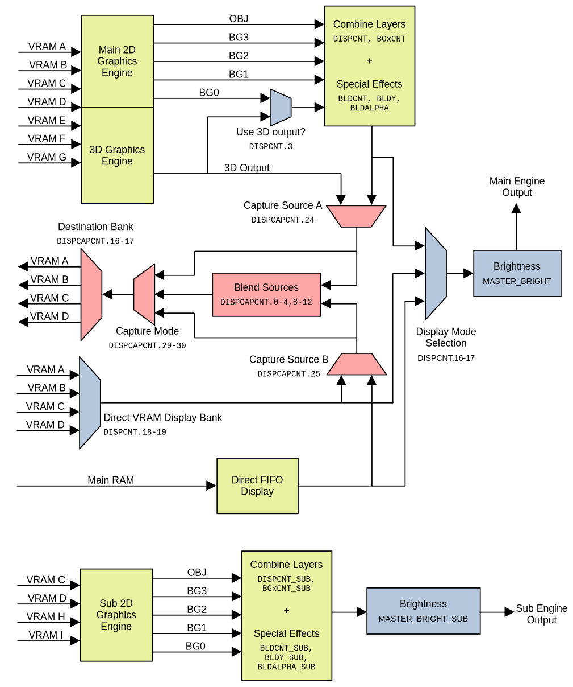
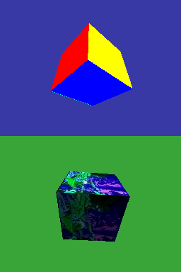
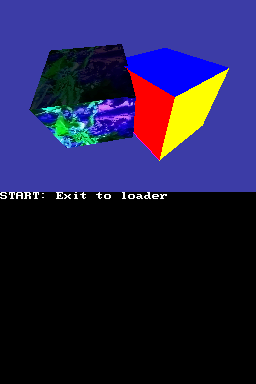
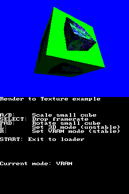

## 1. Introduction

The main video engine of the DS has a very flexible video capture system. It
allows you to capture either the 3D output of the GPU or the full video output
of the main video engine and save it to one of the main VRAM banks (A, B, C or
D). This output can then be processed by the application or displayed right
away. A very popular way to use it is to display 3D graphics on both screens.

This chapter will explain how this system works in detail and it will show a few
examples of things that can be done with it (like displaying 3D graphics on both
screens).

## 2. Video System Diagram

First, we need to understand how the DS hardware works. This diagram (inspired
by the one in [GBATEK](https://problemkaputt.de/gbatek.htm#dsvideodisplaysystemblockdiagram))
shows how the components of the main video engine work together:



Note that the sub graphics engine doesn't support 3D, video capture or the
special video display modes.

The two most important settings of this diagram are:

- The switch to select BG0 or the 3D output with `DISPCNT.3`. Applications that
  display 3D graphics in one screen normally display the 3D output by replacing
  BG0 by the 3D output.

- The global video mode selection switch, selected with `DISPCNT.16-17`, lets
  you choose between displaying:

  - The combined output of the 2D and 3D graphics engine. This is the setting
    we've used in the tutorial until now.
  - The contents of VRAM banks A, B, C or D as a 16-bit background.
  - Data stored in main RAM transferred to the display with a special DMA copy.

There are some advanced ways to do video capture, like blending a user-provided
framebuffer with the output of the video engines. We will start with easier
examples that don't combine multiple inputs, and see some more advanced examles
later.

However, before learning how to use the video capture system, we need to
understand how the additional video modes work. They are required for some
advanced configurations that involve video capture.

## 3. Special video display modes

Until now we have only used regular video modes with `videoSetMode()`. Modes
like `MODE_0_2D`, `MODE_5_2D` or `MODE_0_3D` are all using the normal display
mode in `DISPCNT.16-17`. Let's see how to use the other two special video modes.

### 3.1 Direct VRAM display

Video modes `MODE_VRAM_A`, `MODE_VRAM_B`, `MODE_VRAM_C` and `MODE_VRAM_D` allow
the video hardware to render the contents of VRAM A, B, C or D directly to the
screen. The VRAM bank used as source of the data must be in LCD mode (for
example, `vramSetBankA(VRAM_A_LCD)`). This VRAM bank is treated as a 16-bit
bitmap.

This mode isn't useful for regular graphics display, and it's only really useful
when used at the same time as the video capture system. We will get into more
details later but, for now, remember that only VRAM banks in LCD mode can be
used as destination of a video capture. Using the direct VRAM display mode lets
you use the same VRAM bank as the destination of the video capture and as a
screen framebuffer at the same time.

To use this mode, all you have to do is this, for example:

```c
vramSetBankB(VRAM_B_LCD);
videoSetMode(MODE_VRAM_B);
```

You can modify the contents of the framebuffer by using the `VRAM_B` define:

```c
volatile uint16_t *fb = VRAM_B;
fb[256 * y + x] = RGB15(31, 0, 0);
```

Check the following example to see it in action:
[`examples/graphics_2d/video_mode_vram`](https://codeberg.org/blocksds/sdk/src/branch/master/examples/graphics_2d/video_mode_vram)

### 3.2 Main RAM FIFO display

This is another special video mode that lets you keep a framebuffer in main RAM
and transfer it to the video engine with a special DMA transfer mode. This
special DMA transfer needs to be started every frame. For example, you can do
the following to start a new transfer every frame in the VBL handler:

```c
void vbl_handler(void)
{
    // Stop previous DMA transfer if it's active

    dmaStopSafe(3);

    // Handle double buffering

    // ...

    // Start DMA tranfer

    void *fb = framebuffer[framebuffer_displayed];

    // The source address must be in main RAM.
    REG_DMA_SRC(3) = (uintptr_t)fb;
    // The destination must be REG_DISP_MMEM_FIFO.
    REG_DMA_DEST(3) = (uintptr_t)&REG_DISP_MMEM_FIFO;

    REG_DMA_CR(3) =
        DMA_DISP_FIFO | // Set direct FIFO display mode
        DMA_SRC_INC |   // Increment the source address each time
        DMA_DST_FIX |   // Fix the destination address to REG_DISP_MMEM_FIFO
        DMA_REPEAT |    // Don't stop after the first transfer
        DMA_COPY_WORDS | 4; // Copy 4 words each time (8 pixels)
}

int main(int argc, char *argv[])
{
    videoSetMode(MODE_FIFO);

    irqSet(IRQ_VBLANK, vbl_handler);

    // ...
}
```

This is an example of how to do it in practice:
[`examples/graphics_2d/video_mode_fifo`](https://codeberg.org/blocksds/sdk/src/branch/master/examples/graphics_2d/video_mode_fifo)

It's also possible to use this system to provide the input B of the video
capture system and mix it with the output of the 2D or 3D engines.

## 4. Simple capture

The most basic way to use the video capture system is to capture the display,
save it to VRAM, and display it later. You can keep using the main and sub video
engines as usual.

In this case all we need to do is to capture the output of the 3D and 2D video
engines, so we need to use source A of the video capture system, which lets us
choose what to capture. The steps are:

- Set one of VRAM A, B, C or D to LCD mode. It will be used to store the
  captured image.

  ```c
  vramSetBankC(VRAM_C_LCD);
  ```

- Start the video capture, which will capture the following frame. You can
  capture the 3D otuput with `DCAP_SRC_A_3DONLY` or the combined 3D+2D output
  with `DCAP_SRC_A_COMPOSITED`:

  ```c
  REG_DISPCAPCNT =
      // Destination is VRAM_C
      DCAP_BANK(DCAP_BANK_VRAM_C) |
      // Size = 256x192
      DCAP_SIZE(DCAP_SIZE_256x192) |
      // Capture source A only
      DCAP_MODE(DCAP_MODE_A) |
      // Source A = 3D rendered image
      DCAP_SRC_A(DCAP_SRC_A_3DONLY) |
      // Enable capture
      DCAP_ENABLE;
  ```

You can see this system in action in the following example, which lets you
experiment with the 3D and 3D+2D capture modes:
[`examples/video_capture/simple_capture`](https://codeberg.org/blocksds/sdk/src/branch/master/examples/video_capture/simple_capture)


You can capture the 3D output with `DCAP_SRC_A_3DONLY` even if you don't display
it directly in background layer 0. For example, you can use `MODE_0_2D` instead
of `MODE_0_3D` and the video capture system will still be able to capture the 3D
output. However, `DCAP_SRC_A_COMPOSITED` won't capture it!


Once you have this basic capture system working, you can even save the result to
the SD card as a screenshot! The following example uses lodepng to save the
captured image as a PNG file:
[`examples/video_capture/png_screenshot`](https://codeberg.org/blocksds/sdk/src/branch/master/examples/video_capture/png_screenshot)

## 5. Dual screen 3D

This is probably the most popular way to use the video capture system. The idea
is to render the 3D scene of one screen in odd frames and the other screen in
even frames.



There are a few big disadvantages of doing this:

- You need to dedicate at least one main VRAM bank (A, B, C or D) as destination
  of the captured 3D output:

  - You have less space for textures just when you are going to display more 3D
    objects.

  - Most dual 3D setups involve dedicating two main VRAM banks as framebuffers
    because it it's easier and it doesn't involve any manual copy.

  - You can create a system in which you only use a main VRAM bank, but you need
    to allocate your framebuffers in main RAM, and you need to do a DMA copy per
    frame to copy the captured contents of the VRAM bank to the right
    framebuffer.

- The overall framerate of your game will drop to 30 FPS because the GPU can
  only output 60 3D frames per second, and you have to split them between the
  two screens.

- Some implementations of dual 3D are very sensitive to frame drops. If the
  application slows down, the contents of the screen may end up switching
  screens.

In this tutorial we're only going to see a simple implementation of dual 3D
graphics using 2 VRAM banks in a way that is resistant to frame drops:
[`examples/video_capture/dual_screen_3d`](https://codeberg.org/blocksds/sdk/src/branch/master/examples/video_capture/dual_screen_3d)

Let's see how the graphics rendering code works. This code alternates between
two configurations, and it requires alternating the output of the main and sub
video engines between the top and bottom screens:

- **Configuration 1:**

  - Main engine is on the top screen.

    ```c
    lcdMainOnTop();
    ```

  - Main engine: VRAM C is in LCD mode. The engine is set to direct VRAM C
    display mode. VRAM C is the destination of the video capture, and it
    captures the 3D output only.

    ```c
    videoSetMode(MODE_VRAM_C);
    vramSetBankC(VRAM_C_LCD);

    REG_DISPCAPCNT =
        // Destination is VRAM_C
        DCAP_BANK(DCAP_BANK_VRAM_C) |
        // Size = 256x192
        DCAP_SIZE(DCAP_SIZE_256x192) |
        // Capture source A only
        DCAP_MODE(DCAP_MODE_A) |
        // Source A = 3D rendered image
        DCAP_SRC_A(DCAP_SRC_A_3DONLY) |
        // Enable capture
        DCAP_ENABLE;
    ```

  - Sub engine: VRAM D is displayed as a matrix of 16-bit bitmap sprites. VRAM D
    can't be used as background VRAM in the sub engine.

    ```c
    videoSetModeSub(MODE_0_2D | DISPLAY_SPR_ACTIVE | DISPLAY_SPR_2D_BMP_256);
    vramSetBankD(VRAM_D_SUB_SPRITE_0x06600000);
    ```

- **Configuration 2:**

  - Main engine is on the bottom screen.

    ```c
    lcdMainOnBottom();
    ```

  - Main engine: Same as configuration 1, but using VRAM D.

    ```c
    videoSetMode(MODE_VRAM_D);
    vramSetBankD(VRAM_D_LCD);

    REG_DISPCAPCNT =
        // Destination is VRAM_D
        DCAP_BANK(DCAP_BANK_VRAM_D) |
        // Size = 256x192
        DCAP_SIZE(DCAP_SIZE_256x192) |
        // Capture source A only
        DCAP_MODE(DCAP_MODE_A) |
        // Source A = 3D rendered image
        DCAP_SRC_A(DCAP_SRC_A_3DONLY) |
        // Enable capture
        DCAP_ENABLE;
    ```

  - Sub engine: VRAM C is displayed as a 16-bit bitmap.

    ```c
    videoSetModeSub(MODE_5_2D | DISPLAY_BG2_ACTIVE);
    vramSetBankC(VRAM_C_SUB_BG_0x06200000);
    ```

This example lets you simulate frame drops too. If you hold the A button the
main loop will be stuck in a loop that doesn't let the rendering code be
executed. This is an extreme example of dropping frames, and you can see that
the screens stop being updated but the image remain stable.

The reason why this is stable is that the same bank is used as framebuffer of
the main engine and as destination of the 3D output. Normally, the main engine
displays the outdated data stored in VRAM while it captures the following frame.
If the rendering code is delayed, the captured frame will replace the outdated
data and it will be displayed instead, which would have happened anyway.

## 6. Two-pass 3D

The GPU of the DS can only render up to 2048 triangles (or 1536 quads) per
frame, which is usually enough. However, in some specific cases, it can be
restrictive, and you may want to combine the 3D output of multiple frames in one
single image.

There's a very important thing to consider: you can combine the graphics output,
but the depth buffer is lost between two frames. This restriction may make you
think of one solution: sort the polygons by their distance to the camera and
draw the far polygons in the first frame, the near polygons in the second frame,
and display the second frame over the first one.

The problem is that this isn't the optimal way to do it:

- You need to spend CPU time sorting your polygons by depth.

- If you think about it, the most optimal way to distribute polygons between two
  frames is a way that makes each frame render a similar number of pixels per
  scanline. Far polygons usually belong to the background, which takes up a lot
  more space on the screen than near polygons, which usually belong to smaller
  objects. The GPU has a limit of how many pixels it can render per scanline,
  and this distribution will make it very easy to reach the limit in the
  background frame while you leave a lot of unused time in the near-polygons
  frame.

A better way to distribute the work is to draw the left and right halves of the
screen in alternate frames. This has some advantages:

- There are no issues related to the depth buffer. You can just draw your
  polygons as you would do in a regular game without two-pass 3D. You don't need
  to sort objects in any specific way.

- Your horizontal lines are half the length as usual, so it's harder to reach
  the limit of pixels that the GPU can draw in a scanline.

- You can set the screen division at any coordinate, it doesn't have to be right
  in the middle.

The following example uses the left/right split:
[`examples/video_capture/two_pass_3d`](https://codeberg.org/blocksds/sdk/src/branch/master/examples/video_capture/two_pass_3d)



This example works by using the FIFO display mode, so the 3D output is always
hidden. There are two framebuffers in main RAM (active and backbuffer). It
works the following way:

- Even frames:

  - The 3D projection and viewport are setup to draw the left half of the 3D
    scene.

    ```c
    const int split = 128;

    glViewport(0, 0, split - 1, 191);

    glMatrixMode(GL_PROJECTION);
    glLoadIdentity();

    glFrustumf32(-128 * 3, (-128 + split) * 3, 96 * 3, -96 * 3,
                 floattof32(0.1), floattof32(40));
    ```

  - The 3D scene is rendered and captured directly to VRAM D:

    ```c
    REG_DISPCAPCNT =
        // Destination is VRAM_D
        DCAP_BANK(DCAP_BANK_VRAM_D) |
        // Size = 256x192
        DCAP_SIZE(DCAP_SIZE_256x192) |
        // Capture source A only
        DCAP_MODE(DCAP_MODE_A) |
        // Source A = 3D rendered image
        DCAP_SRC_A(DCAP_SRC_A_3DONLY) |
        // Enable capture
        DCAP_ENABLE;
    ```

  - The right half of VRAM D (captured the previous frame) is copied to the
    backbuffer in main RAM.

- Odd frames:

  - The 3D projection and viewport are setup to draw the right half of the 3D
    scene.

    ```c
    const int split = 128;

    glViewport(split, 0, 255, 191);

    glMatrixMode(GL_PROJECTION);
    glLoadIdentity();

    glFrustumf32((-128 + split) * 3, (-128 + 256) * 3, 96 * 3, -96 * 3,
                 floattof32(0.1), floattof32(40));
    ```

  - The 3D scene is rendered and captured directly to VRAM D with the same
    setup as before.

  - The left half of VRAM D (captured the previous frame) is copied to the
    backbuffer in main RAM.

  - The backbuffer and active buffer are flipped.

    ```c
    framebuffer_next_ready = true;
    ```

In order for the FIFO display mode to work, a new DMA transfer starts every
frame in the VBL handler:

```c
dmaStopSafe(2);

// [...]

void *fb = framebuffer[framebuffer_displayed];

// The source address must be in main RAM.
REG_DMA_SRC(2) = (uintptr_t)fb;
// The destination must be REG_DISP_MMEM_FIFO.
REG_DMA_DEST(2) = (uintptr_t)&REG_DISP_MMEM_FIFO;

REG_DMA_CR(2) =
    DMA_DISP_FIFO | // Set direct FIFO display mode
    DMA_SRC_INC |   // Increment the source address each time
    DMA_DST_FIX |   // Fix the destination address to REG_DISP_MMEM_FIFO
    DMA_REPEAT |    // Don't stop after the first transfer
    DMA_COPY_WORDS | 4; // Copy 4 words each time (8 pixels)
```

You should update your logic at 30 FPS at most. If you update the state of your
game after drawing one half of the screen but before drawing the next one, you
will get inconsistent graphics on both halves.

Check the source code of the example if you want to see the full logic of this
process. Note that this system makes the graphics safe even if the framerate
drops temporarily.

## 7. Render to Texture

This technique lets you render a 3D scene and use it as a texture to be used in
a different scene. For example, you could render a living room with a TV, and
the TV is displaying a different 3D scene.

There's an example of how to do it here:
[`examples/video_capture/render_to_texture`](https://codeberg.org/blocksds/sdk/src/branch/master/examples/video_capture/render_to_texture)



This example shows two ways of achieving this effect, but only one of them is
stable in case of FPS drops. We'll only discuss the stable version here.

This example uses VRAM C as the framebuffer that gets displayed on the main
screen (the 3D output is never displayed directly on the screen):

```c
videoSetMode(MODE_VRAM_C);
vramSetBankC(VRAM_C_LCD);
```

Frames work the following way:

- Odd frames: VRAM B is set as destination of the video capture. The video
  capture is configured to capture the 3D image only:

  ```c
  vramSetBankB(VRAM_B_LCD);

  REG_DISPCAPCNT =
      // Destination is VRAM_B
      DCAP_BANK(DCAP_BANK_VRAM_B) |
      // Size = 256x192
      DCAP_SIZE(DCAP_SIZE_256x192) |
      // Capture source A only
      DCAP_MODE(DCAP_MODE_A) |
      // Source A = 3D rendered image
      DCAP_SRC_A(DCAP_SRC_A_3DONLY) |
      // Enable capture
      DCAP_ENABLE;
  ```

- Even frames: VRAM B is setup as texture VRAM. We will use it when drawing the
  3D scene. The 3D scene is captured to VRAM C.

  ```c
  vramSetBankB(VRAM_B_TEXTURE);

  REG_DISPCAPCNT =
      // Destination is VRAM_C
      DCAP_BANK(DCAP_BANK_VRAM_C) |
      // Size = 256x192
      DCAP_SIZE(DCAP_SIZE_256x192) |
      // Capture source A only
      DCAP_MODE(DCAP_MODE_A) |
      // Source A = 3D rendered image
      DCAP_SRC_A(DCAP_SRC_A_3DONLY) |
      // Enable capture
      DCAP_ENABLE;
  ```

The two scenes are organized like this:

- When drawing the full scene we set the viewport to the full screen:

  ```c
  glViewport(0, 0, 255, 191);
  ```

  When we want to use the captured scene as a texture we need to set it as
  active texture with a bit of special code:

  ```c
  // When calling glBindTexture(), the GFX_TEX_FORMAT
  // command is only sent when the new texture isn't
  // currently active. By calling it with an invalid
  // texture we make sure that any future call to
  // glBindTexture() will actually send that command and
  // replace the manual command below.
  glBindTexture(0, -1);

  // The captured texture is 256x192, stored in VRAM_B,
  // and is in RGBA format. It is needed to use 256x256 as
  // size, as only power of two sizes are supported.
  GFX_TEX_FORMAT = (GL_RGBA << 26)
                 | (TEXTURE_SIZE_256 << 20)
                 | (TEXTURE_SIZE_256 << 23)
                 | ((((uintptr_t)VRAM_B) >> 3) & 0xFFFF);
  ```

- When drawing the texture scene, we setup the viewport to the size of the
  texture used in the model (like the TV). In this case, the cube is using a
  128x128 pixels texture, so we render the full 256x192 scene, but we only focus
  on the top-left 128x128 pixels of it:

  ```c
  glViewport(0, 64, 128, 191);
  ```

Important note: The texture allocator of libnds looks for any VRAM bank setup as
texture storage when a new texture is loaded. In this render to texture example
we are alternating VRAM B between LCD and texture mode, so it's possible that
libnds uses it as destination of textures if you load textures on the fly.

This isn't a problem in this example because textures are only loaded at the
start of the program, but you should make sure to lock your VRAM banks in your
applications. Locking a bank will ensure that libnds doesn't try to allocate
textures or texture palettes to it:

```c
glLockVRAMBank(VRAM_B);
glLockVRAMBank(VRAM_C);
```

You can unlock them with:

```c
glUnlockVRAMBank(VRAM_B);
glUnlockVRAMBank(VRAM_C);
```


This chapter is a work in progress...

