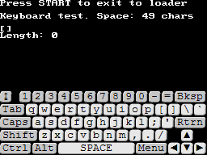
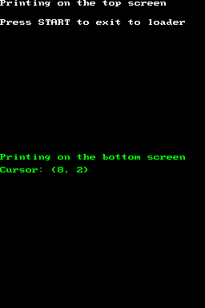
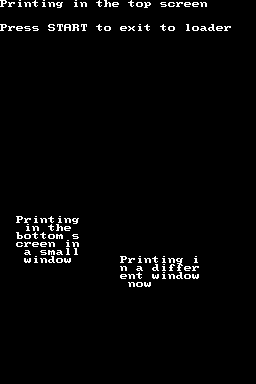
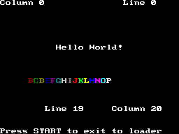
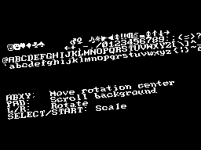

## 1. Introduction

Libnds provides a basic implementation of a text console and a keyboard that you
can use in your applications. By default, they are loaded to the sub 2D engine,
and they can be used together to make simple text-based applications:



They are very flexible. They can be loaded to the main 2D engine as well, and
you're allowed to define your own graphics. You can have multiple consoles that
affect different parts of the screen (or different screens). You can even define
your own behaviour for the console and keyboard, to some extent.


The default text console and keyboard init functions initialize them in the 2D
sub engine without any manual setup. This is ideal for quick tests.


## 2. Text console

## 2.1 Basic usage

The easiest way to use the text console is to call `consoleDemoInit()`. This
will initialize the console right away without any additional manual setup.
However, that means that it needs to setup the 2D hardware internally, so it's a
good idea to know what it does. If not, you may change some important setting
and the console will stop working:

- Set video mode 0 in the sub engine.
- Map VRAM C as background VRAM.
- Set the screen brightness to the default one.
- Initialize the console with the default font in the default tileset and map
  slots.

If you want to use the console while doing other things in the same screen, you
should use `consoleInit()` instead and provide your own settings:

```c
PrintConsole *consoleInit(PrintConsole *console,
                          int layer,
                          BgType type, BgSize size,
                          int mapBase, int tileBase,
                          bool mainDisplay, bool loadGraphics);
```

Let's see what each argument does:

- `console` lets you define the console struct to be initialized. If you use
  `NULL` the function will initialize the last console to be selected with
  `consoleSelect()` (or the default console if you haven't selected any
  console yourself). We will see this in more detail later.
- `layer` is just the background layer where the console is displayed.
- `type` and `size` are values of the `BgType` and `BgSize` enums. You can check
  the chapter about [backgrouds](../backgrounds) to know more about it.
  Normally you will use `BgType_Text4bpp` or `BgType_Text8bpp` with
  `BgSize_T_256x256`.
- `mapBase` and `tileBase` are the tile and map bases to use for the background
  used by the console.
- `mainDisplay` can be set to `true` to display the console on the main screen,
  or `false` to display it on the sub screen.
- `loadGraphics` can be set to `true` to load the default libnds graphics or
  `false` if you have already loaded your own graphics. If you use the default
  graphics, set `type` to `BgType_Text4bpp` and `size` to `BgSize_T_256x256`.

As soon as the console is initialized you can start printing text with standard
C functions like `printf()`, `putc()`, or using things like `cout` in C++. Also,
note that you can call `consolePrintChar()` to print a single char without
bringing it all the standard library code. You can clear the screen by calling
`consoleClear()`.

You can freely move the cursor around the screen by using functions
`consoleSetCursor()` and `consoleAddToCursor()`. You can also get the position
of the cursor by using `consoleGetCursor()`.

You can also change the color of the cursor to a set of predefined colors in the
`ConsoleColor` enum. You can use `consoleSetColor()` for this. For example, the
following code will set the color of the current console to green:

```c
consoleSetColor(NULL, CONSOLE_GREEN);
```

Note that this will only work with the default text font. We will see how to
support multiple colors with custom fonts later.

## 2.2 Text consoles in both screens

Now that we know how to initialize custom text consoles, let's see how to use
display a different text console in each screen:

```c
int main(int argc, char **argv)
{
    // Storage for each console
    PrintConsole topScreen;
    PrintConsole bottomScreen;

    // Initialize a video mode that can display text backgrounds in both screens
    videoSetMode(MODE_0_2D);
    videoSetModeSub(MODE_0_2D);

    // Assign some VRAM to be used for main engine and sub engine backgrounds
    vramSetBankA(VRAM_A_MAIN_BG);
    vramSetBankC(VRAM_C_SUB_BG);

    // Initialize both consoles in layer 3 of each screen. Load the graphics.
    consoleInit(&topScreen, 3, BgType_Text4bpp, BgSize_T_256x256, 31, 0, true, true);
    consoleInit(&bottomScreen, 3, BgType_Text4bpp, BgSize_T_256x256, 31, 0, false, true);

    // Select the bottom screen console to start writing to it
    consoleSelect(&bottomScreen);
    printf("Printing on the bottom screen\n");

    // Select the top screen console to start writing to it
    consoleSelect(&topScreen);
    printf("Printing on the top screen\n");

    while (1)
        swiWaitForVBlank();
}
```


The `PrintConsole` structs need to remain valid while you're using the console.
You may want to make them global variables by defining them outside of `main()`
in your own application.


You can check the code of the example here:
[`examples/console/both_screens`](https://github.com/blocksds/sdk/tree/master/examples/console/both_screens)



## 2.3 Using console windows

By default, console instances use all the space available on the screen to print
text. If you want to restrict the area where a specific console can print, you
can use `consoleSetWindow()`. You can even have multiple console instances
printing to different parts of the same screen.



You can check the code of the example here:
[`examples/console/console_windows`](https://github.com/blocksds/sdk/tree/master/examples/console/console_windows)

The important part is this one:

```c
PrintConsole bottomScreen1;
PrintConsole bottomScreen2;

consoleInit(&bottomScreen1, 3, BgType_Text4bpp, BgSize_T_256x256,
            31, 0, false, true);
bottomScreen2 = bottomScreen1;

consoleSetWindow(&bottomScreen1, 2, 3,  // Top-left corner
                                 8, 8); // Size
consoleSetWindow(&bottomScreen2, 15, 8,
                                 10, 5);
```

We need to initialize one `PrintConsole` struct correctly, and then we can just
copy it as many times as we want if we want to create new console windows in the
same screen. This way the internal settings like background layer, map slot,
tileset slot, etc, are preserved, but you can change the window dimensions.

## 2.4 ANSI console

The text console supports ANSI escape sequences. They are special strings
that can be sent to printf() and have special effects on the console. For
example, `printf("\x1b[2J");` will clear the console.

Libnds doesn't support all escape sequences, you can check the documentation
[here](https://blocksds.skylyrac.net/libnds/arm9_2console_8h.html) to see which
ones are supported.

In general, libnds supports setting the position of the cursor (you can even
save the current cursor screen, move it, then restore the previous position),
clearing the screen, and changing the color of the text.

A list of all ANSI escape sequences is available
[here](https://en.wikipedia.org/wiki/ANSI_escape_code#CSI_(Control_Sequence_Introducer)_sequences).

Most things you can do with ANSI sequences in libnds can also be done with other
functions. ANSI sequences aren't very readable, so you may prefer to use the
functions provided by libnds instead.

You can see an example of using ANSI sequences here:
[`examples/console/ansi_console`](https://github.com/blocksds/sdk/tree/master/examples/console/ansi_console)



## 2.5 Custom fonts

The console system of libnds lets you define your own text font. This font can
be specified in different formats. For example, the default font of libnds is a
1 bpp font that gets expanded to 4 bpp when it gets loaded.

This is an example of how to load a custom 4 bpp font:

```c
// Size of a font character in 4 bpp mode in bytes
const size_t size_char_4bpp = (8 * 8) / 2;

ConsoleFont font_futuristic = {
    .gfx = charmap_futuristicTiles,
    .pal = charmap_futuristicPal, // Set to NULL to not load a palette
    .numColors = charmap_futuristicPalLen / 2, // Set to 0 if there's no palette
    .bpp = 4,
    .asciiOffset = 32,
    .numChars = charmap_futuristicTilesLen / size_char_4bpp,
};

int main(int argc, char *argv[])
{
    /// ...

    PrintConsole console;

    // Initialize the console with default libnds settings, but don't load
    // the default font.
    consoleInitEx(&console,
                  2,                // Background layer
                  BgType_Text4bpp,  // 4 bpp mode
                  BgSize_T_256x256, // Size of the background layer
                  1,                // Use map base 1 (they can't be shared)
                  3,                // Use tile base 3
                  0,                // Use palette index 0 (16 color palettes)
                  0,                // Start from character 0
                  false,            // Sub screen
                  false);           // Don't load graphics

    // Load the custom graphics
    consoleSetFont(&console, &font_futuristic);

    /// ...
}
```

You can load multiple text fonts to be used by different consoles. Sometimes you
can even share one tileset slot for two different fonts if they are small
enough.

You can see an example of how to load multiple text fonts, including loading
multiple fonts in one screen and sharing a tileset slot:
[`examples/console/custom_font`](https://github.com/blocksds/sdk/tree/master/examples/console/custom_font)


This other example shows how to use an extended affine background instead of a
text background. This system lets you scale and rotate the layer that holds your
text:
[`examples/console/console_rotscale`](https://github.com/blocksds/sdk/tree/master/examples/console/console_rotscale)



The difference is the way in which the console is initialized:

```c
PrintConsole *console = consoleInit(NULL, 3, BgType_ExRotation, BgSize_ER_256x256,
                                    31, 0,
                                    true, // Main screen
                                    false); // Don't load graphics
```


If you want to support text colors you need to use a 4 bpp background layer and
you need to include all your different color combinations to the text font
palette. The only thing that `consoleSetColor()` does is to change the palette
used when writing new text to the screen.



Using a 8 bpp tiled background will prevent you from changing the color of the
text with `consoleSetColor()` or ANSI sequences.



This chapter is a work in progress...

