## 1. Introduction

The Nintendo DS has a fairly powerful 3D engine for the size of the console.
libnds contains an OpenGL-like 3D library to use this engine. It isn't real
OpenGL 1 or anything like that. It's just an API that is similar to OpenGL 1 so
that it feels a bit more natural for people already used to it, but it has
nothing in common with modern OpenGL.

While it may look difficult at first, the 3D graphics engine of the Nintendo DS
is, in many ways, easier to use than the 2D graphic engines:

- You only need to configure your VRAM banks as "texture VRAM" and load your
  graphics data anywhere inside them. You don't need to worry about loading the
  right data to background or sprite VRAM, or about tile set and tile map slots
  for backgrounds.
- You don't need to worry about normal vs extended palettes, or about how
  palettes can be used in 16x16 color mode vs 256 color mode. All 3D texture
  palettes are treated the same way.
- There is a limit of 6144 vertices per frame. You can draw up to 2048 triangles
  or 1536 quads, which is a lot for the resolution of the screen.
- You can blend polygons with a lot more freedom than the 2D hardware blending
  registers. You can change the color of textured polygons so that they get
  drawn as if there was a colored filter in front of them.

Also, remember that you can use the 3D engine to render 2D graphics without the
limitations of the 2D graphics engines. We have seen an easy way to do it in the
[GL2D chapter](../gl2d), but you will learn how to do it by hand in this
chapter.

This chapter isn't meant to be a guide about every last detail of the 3D
hardware. If you want to know all of its secrets, check
[GBATEK](https://problemkaputt.de/gbatek.htm#ds3dvideo).

Also, as mentioned in the GL2D chapter, the main limitation of the 3D engine is
that it can only be used in one screen. It is possible to display 3D on both
screens by sacrificing half of the FPS of the application, which will be
explained in detail in a future chapter. In case you can't wait, there is an
example of how this system works here
[`examples/video_capture/dual_screen_3d`](https://github.com/blocksds/sdk/tree/master/examples/video_capture/dual_screen_3d).

## 2. Fixed point types

The GPU uses several types of fixed point for different tasks, and there are
some definitions in libnds to help you convert between floating point, integer
values and fixed point:

- `fixed12d3`: Used to represent depth distances (12.3).
- `t16`: Used to represent texture coordinates (12.4).
- `v16`: Used to represent vertices (4.12).
- `v10`: USed to represent normals or vertices (0.10).
- `f32`: Used to represent matrix componets (20.12).

The values inside the parentheses represent the number of bits used as integer
and fractionary parts. For example, `v16` is a signed type that goes from
`0x8000` to `0x7FFF`. This corresponds to `-0x8000 / (1 << 12)` and `0x7FFF /
(1 << 12)` in floating point, which is -8.0 to aprox. 7.99976. Values outside of
this range can't be represented in this format.

If you want a more in-depth explanation, check the chapter about fixed points in
Tonc [here](https://gbadev.net/tonc/fixed.html).

It can be hard to remember which type to use in each function, so most functions
are named after the type of fixed point type required. For example,
`glVertex3v16()` takes three `v16` values as arguments but `glVertex3f()` takes
three floats (that are converted internally to `v16`).

However, you should avoid using floating point values in your game. They can be
convenient to test the code initially, but calculations with floats are very
slow. If you use floating point constants the compiler can optimize calculations
and store only the final result.

For example, if you call `glVertex3f(1.0, 2.0, 3.0)` the compiler will see the
implementation of the function:

```c
static inline void glVertex3f(float x, float y, float z)
{
    glVertex3v16(floattov16(x), floattov16(y), floattov16(z));
}
```

It will see that the result of `floattov16()` is a constant in all three cases
and it will replace the original function call by `glVertex3v16(1 << 12, 2 <<
12, 3 << 12)`. The resulting code is just as efficient, but easier to read.

However, the following code probably won't be optimized and it will try to
convert between floating point and fixed point every time:

```c
float x = 0.0;

while (1)
{
    scanKeys();
    u16 keys = keysHeld();
    if (keys & KEY_LEFT)
        x -= 1.0;
    if (keys & KEY_RIGHT)
        x += 1.0;

    ...

    glVertex3f(x, 2.0, 3.0);

    ...
}
```

In general, you can start with floating point variables when you're learning and
you can switch to fixed point when you want to do something more complicated
that requires a more efficient CPU usage.

## 3. Initialization

A typical program that uses 3D looks like this:

```c
#include <nds.h>

int main(int argc, char *argv[])
{
    // Set any video mode that you want, but enable 3D
    videoSetMode(MODE_0_3D);

    // Initialize GL library
    glInit();

    // Initialize antialiasing. This will soften the edges of the polygons,
    // which is very noticeable on the screen of the DS due to its small
    // resolution.
    glEnable(GL_ANTIALIAS);

    // Setup the 3D rear plane. This plane can have any color that you want, and
    // it can be transparent or opaque. The background must be fully opaque and
    // have a unique polygon ID (different from the polygons that are going to
    // be drawn) so that alpha blending works.
    glClearColor(0, 0, 0, 31);
    glClearPolyID(63);

    // Set the maximum distance at which polygons can be drawn
    glClearDepth(0x7FFF);

    // Set the full screen as the viewport for 3D graphics
    glViewport(0, 0, 255, 191);

    // Set the projection (camera) matrix
    glMatrixMode(GL_PROJECTION);
    glLoadIdentity();
    gluPerspective(70, 256.0 / 192.0, 0.1, 40);

    gluLookAt(0.0, 0.0, 2.0,  // Position
              0.0, 0.0, 0.0,  // Look at
              0.0, 1.0, 0.0); // Up direction

    // Switch to model view matrix
    glMatrixMode(GL_MODELVIEW);

    while(1)
    {
        // Synchronize game loop to the screen refresh
        swiWaitForVBlank();

        // Send commands to the GPU here

        // Render frame
        glFlush(0);
    }

    // Deinitialize 3D hardware and free all memory used by videoGL
    glDeinit();
}
```

A downside of using the 3D engine is that you need to tell the GPU what to draw
every frame. With the 2D hardware you don't have to do anything once you've
configured your background and sprites unless something changes and, when
something changes, all you need to do is reconfigure the specific thing that has
changed. With the 3D hardware you need to send all the polygons to the GPU every
frame, which takes some CPU time. At the end of this chapter we will learn how
to use display lists, which is one of the ways to optimize 3D rendering.

## 4. Polygons

### 4.1 Rendering a polygon

The first thing we need to do is to get a single polygon. Starting from the
example in the previous section, we can replace the contents of the main loop by
this:

```c
    while (1)
    {
        // Synchronize game loop to the screen refresh
        swiWaitForVBlank();

        // Draw scene

        glPolyFmt(POLY_ALPHA(31) | POLY_CULL_NONE);

        glBegin(GL_QUADS);

            glColor(RGB15(31, 0, 0));
            glVertex3v16(floattov16(-1), floattov16(-1), 0);

            glColor(RGB15(31, 31, 0));
            glVertex3v16(floattov16(1), floattov16(-1), 0);

            glColor(RGB15(0, 31, 0));
            glVertex3v16(floattov16(1), floattov16(1), 0);

            glColor(RGB15(0, 0, 31));
            glVertex3v16(floattov16(-1), floattov16(1), 0);

        glEnd();

        // Tell the GPU to use the new scene data in the next frame
        glFlush(0);
    }
```

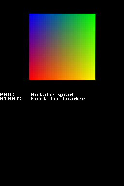

You can check the source code of the example here (note that it uses some
functions we haven't seen in this chapter yet!):
[`examples/graphics_3d/colored_polygon`](https://github.com/blocksds/sdk/tree/master/examples/graphics_3d/colored_polygon)

In this example we're drawing a single quad in which each vertex has a different
color. If you want to see how it looks you can build the code yourself (or you
can wait for the next section of this chapter!).

Function `glPolyFmt()` defines polygon attributes for anything that comes after
it. In this case we're setting:

- Alpha value: A value of 31 in `POLY_ALPHA()` means that polygons are fully
  opaque. A value of 0, however, means that polygons are drawn in wireframe mode
  (we will see an example of this later). Normally you will use values 1-31 for
  different levels of opacity, and you will simply avoid drawing any polygon
  that you don't want to draw (instead of setting the alpha to 0). We will see
  how to use alpha blending properly later.

- Culling: In order to improve performance the GPU can drop polygons that don't
  face the camera. For example, if you're drawing an opaque box, there will
  always be some polygons that you can't see because they are covered by others.
  If you enable back culling, the GPU will ignore them instead of wasting time
  trying to draw them and realizing that there are other polygons in front of
  them. In this example, for simplicity, we are disabling culling with
  `POLY_CULL_NONE`. We will experiment with culling later.

Polygons are drawn by sending a `glBegin()` command, calling some version of
`glVertex*()` and other related functions, and finishing with `glEnd()`. In this
case we're going to draw a quad, so we use `GL_QUADS`. `glColor()` sets the
color for the vertices drawn after the command, and `glVertex3v16()` sends new
vertices to the GPU with the 3 provided coordinates.

When all polygons have been sent to the GPU we call `glFlush()` so that the GPU
starts working on them for the next frame.

### 4.2 Types of polygons

The DS supports triangles and quads. You can draw them as individual polygons or
in strips. Also, you can draw lines (if two of the vertices of a triangle have
the same coordinates) and even dots (if all three coordinates are the same).
However, some old emulators don't display lines and dots correctly.

This image shows the types of polygon primitives you can use:

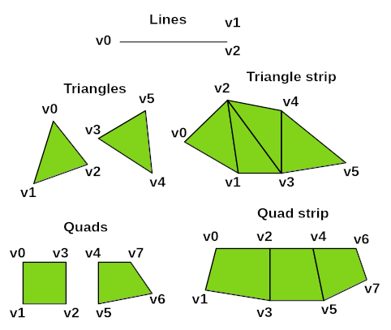

- `GL_TRIANGLES`: You can call `glBegin(GL_TRIANGLES)` once and then send all
  the vertices you need to the GPU. Every 3 vertices it will draw a new
  triangle. If you want to draw lines or dots, you should use this type as well.
  You can draw lines and dots with other types, but triangles use fewer
  vertices than quads. Call `glEnd()` when you're done drawing triangles.
- `GL_QUADS`: It works like `GL_TRIANGLES`, it draws a quad per each group of 4
  vertices the GPU receives. Note that you can't draw any shape you want with
  quads. The two edges at each vertex can't have an angle greater than 180º, and
  vertices must be sent in the order shown in the image.
- `GL_TRIANGLE_STRIP`: After `glBegin(GL_TRIANGLE_STRIP)` you need to send 3
  vertices to define the first triangle. After that, the next triangles will be
  defined as the last two vertices sent plus the new vertex. If you want to
  start a new strip you need to call `glEnd()` and `glBegin()` again.
- `GL_QUAD_STRIP`: It's similar to `GL_TRIANGLE_STRIP`. First, send 4 vertices
  to define a quad, and then send 2 more vertices per quad. Note that the order
  of vertices doesn't match the one of `GL_QUADS`.

### 4.3 Types of vertex commands

There are multiple commands to send vertices to the GPU. The GPU has a few
registers that receive different types of arguments to optimize the way you draw
your polygons:

- `GFX_VERTEX16`: This is the most common way to define vertices. You need to
  write the 3 coordinates using `v16` fixed point. The coordinates can go from
  -8.0 to about 7.99. Each vertex requires two writes (the first one contains X
  and Y, the second one just Z). This command gives you the greatest possible
  range of coordinates, but it requires more writes.

- `GFX_VERTEX10`: This command lets you write the 3 components in one single
  write, but it uses `v10` format. That means you can use coordinates between
  -1.0 to about 0.99. It gives you less accuracy than `GFX_VERTEX16`, but it's a
  smaller command, so it may be a good idea to use it if you don't need all the
  possible accuracy.

- `GFX_VERTEX_XY`, `GFX_VERTEX_XZ`, `GFX_VERTEX_YZ`: They use `v16`, but they
  only require two components to define a new vertex. The third component is the
  one of the previous vertex. For example, if you use `GFX_VERTEX16` followed by
  `GFX_VERTEX_XY`, the Z component of the second vertex is the one of the
  `GFX_VERTEX16` command.

- `GFX_VERTEX_DIFF`: This command takes three `v10` fixed point values and it
  generates a new vertex by adding the values to the previous vertex.
  Internally, vertex coordinates are stored as `v16`. `v10` values are converted
  to `v16` and added to the previous vertex. The `v16` value can overflow, so
  be careful with it.

If you want to draw objects that don't fit in the coordinate ranges of the
vertex commands you should scale your model down in your 3D modelling program.
For example, you can reduce it to a box of size 1.0 x 1.0 x 1.0 and use a
`glScale()` command before drawing the model so that it's scalled up to the
right size.

For more information about the registers, check
[this](https://problemkaputt.de/gbatek.htm#ds3dpolygondefinitionsbyvertices).

## 5. Moving the camera

The "camera" of your game is implemented in hardware as transformation matrices.
The matrices are stored in the 3D hardware, and all calculations done to them
are accelerated by hardware.

Normally you will use `glMatrixMode(GL_PROJECTION)` to setup you global
transformations (your camera), and `glMatrixMode(GL_MODELVIEW)` to setup the
transformation of a specific model. While in `GL_MODELVIEW` mode you will
transform the matrix several times, going back an forth to setup the
transformations for each one of your models.

You can easily transform your view with functions like `glTranslatef32()`,
`glScalef32()`, `glRotateX()`, etc. Check the documentation of libnds
[here](../../../libnds/videoGL_8h.html) for the full list of functions.

Models are usually drawn with vertices around the center of coordinates. For
example, you wouldn't move a box by adding the position of the box to the
coordinates of all the vertices of the box. You would always draw the box around
coordinates (0, 0, 0) and use translation commands to adjust the coordinates.

`glPushMatrix()` can save your current transformations in the stack for later,
and you can use `glPopMatrix()` later to restore the previous transformations
quickly.

With that knowledge you now know about all the functions used in the previous
example: [`examples/graphics_3d/colored_polygon`](https://github.com/blocksds/sdk/tree/master/examples/graphics_3d/colored_polygon)

This tutorial doesn't have any example of a complex room being drawn, but it's
still important to understand the idea. For example, imagine you're inside a
room. You have:

- Walls, ceiling, floor, maybe fixed furniture like a wardrobe.
- Table, which can be moved by the player, with some objects on top.
- Chair, which can also be moved by the player, with other different objects.

You could do something like this:

```c
while (1);
{
    // Setup the camera to match the position of your player and the direction
    // it's looking at.
    glMatrixMode(GL_PROJECTION);
    glLoadIdentity(); // Reset matrix
    setup_camera(); // Set the camera

    // Start drawing models
    glMatrixMode(GL_MODELVIEW);
    glLoadIdentity();

    // Now you can draw the floor, walls, ceiling, etc of the room
    draw_world();

    // We're going to draw the table, so we preserve the current transformations
    glPushMatrix();

    {
        move_to_table_position();
        draw_table();

        move_to_table_top();

        for (int i = 0; i < num_objects; i++)
        {
            glPushMatrix();

                move_to_object(i);
                draw_objects(i);

            glPopMatrix(1);
        }
    }

    // Restore the previous transformations.
    glPopMatrix(1);

    glPushMatrix();

    {
        move_to_chair_position();
        draw_chair();

        move_to_chair_top();

        for (int i = 0; i < num_objects; i++)
        {
            glPushMatrix();

                move_to_object(i);
                draw_objects(i);

            glPopMatrix(1);
        }
    }

    glPopMatrix(1);

    // Draw everything
    glFlush(0);
}
```

## 6. Culling

When you draw polygons you send the vertices to the GPU in a specific order.
This order is used by the GPU to decide whether the polygon is facing the camera
or away from it. If vertices are counter-clockwise when rendered on the screen
the GPU considers the polygon to be facing the camera.

Example [`examples/graphics_3d/basic_cube`](https://github.com/blocksds/sdk/tree/master/examples/graphics_3d/basic_cube)
shows the effects of using back culling (on the left) or front culling (on the
right). Back culling shows the model as expected because it doesn't draw the
polygons that you don't normally see. Front culling hides the polygons you
normally see:

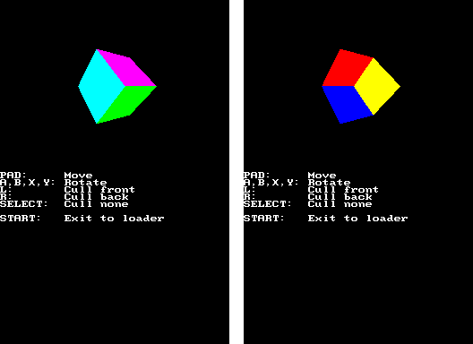

Normally you won't be defining polygons by hand, so you don't have to worry
about the order of the polygons. Your 3D modelling program will export vertices
in the right format.

## 7. Using textures

Textures can be used to apply images to your polygons like in this example:

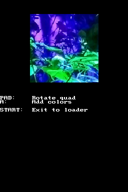

Essentially, you need to:

- Convert your files to the right format.
- Assign some VRAM memory for 3D textures and 3D texture palettes.
- Load the textures.
- Before drawing textured polygons, tell the GPU to use that texture.
- While drawing textured polygons, send texture coordinates to the GPU
  interleaved with the vertices of the model.

The screenshot shown before corresponds to the example
[`examples/graphics_3d/basic_texture`](https://github.com/blocksds/sdk/tree/master/examples/graphics_3d/basic_texture).
Let's see what has changed compared to the previous examples.

1. We can see that there is an image in the `graphics` folder, and the
   corresponding `.grit` file contains the following parameters:

   ```sh
   # 16 bit texture bitmap, force alpha bit to 1
   -gx -gb -gB16 -gT!
   ```

   This generates a 16-bit texture in RGBA format. This is the easiest texture type
   to load because it doesn't need a palette. We will see how to use paletted
   textures later.

2. Enable textures and assign some VRAM memory to be used for textures.

   ```c
   glEnable(GL_TEXTURE_2D);

   vramSetBankA(VRAM_A_TEXTURE);
   ```

   Only VRAM banks A to D can be used to store textures. The size of the banks
   is 128 KiB. This is easier than the VRAM modes for 2D graphics because there
   is only one mode for 3D textures (and one mode for 3D palettes, as we will
   see later). To load a texture you need to do the following:

3. You need an `int` that will contain a texture ID (called name in the videoGL
   documentation) that you need to use to interact with videoGL when you want to
   use or delete the texture.

   ```c
   int textureID;
   ```

4. Generate a texture ID. This function allocates a struct that contains texture
   metadata, but it doesn't allocate any texture data yet.  You can generate
   multiple IDs with a single call by providing an array of integers and passing
   the number of integers in the first argument.

   ```c
   if (glGenTextures(1, &textureID) == 0)
   {
       printf("Failed to generate ID\n");
       while (1)
           swiWaitForVBlank();
   }
   ```

5. Now that we have a valid ID, tell videoGL that this texture is the active
   texture we are going to use.

   ```c
   glBindTexture(0, textureID);
   ```

6. Finally, try to load it. This function tries to load a texture to the active
   texture ID. It can fail if there isn't enough memory or there is no active
   texture. This function will look for all VRAM banks assigned as texture VRAM
   and it will try to allocate the data there. It will ignore banks assigned to
   other types of data.

   ```c
   if (glTexImage2D(
           0, 0,     // Unused parameters (for compatibility with OpenGL)
           GL_RGBA,  // Texture format
           128, 128, // Texture size (width, height)
           0,        // Unused parameter (for compatibility with OpenGL)
           TEXGEN_TEXCOORD,  // Texture parameters (explained later)
           neonBitmap) == 0) // Pointer to the data
   {
       printf("Failed to load texture\n");
       while (1)
           swiWaitForVBlank();
   }
   ```

   `glTexImage2D()` in libnds has 3 unused parameters because the OpenGL version
   of this image uses them for things that aren't supported on DS. The
   parameters have been kept in the function prototype to help porting OpenGL
   code to libnds.


While you're copying 3D textures or palettes to VRAM the GPU doesn't have access
to them. If the GPU tries to access textures at this time it will read white
pixels. You can try to load textures in the vertical blanking period, but it
isn't very reliable. We will see later how to load textures on the fly safely.
For now, only load textures during loading screens in your application or game.


Most of the time you will use multiple textures, so you need to remember to bind
textures when you want to use them. In general, you need to do something like
this to draw textured polygons:

```c
glBindTexture(0, textureID);

// For now, set the color to white so that we can see the plain texture clearly
glColor3f(1, 1, 1);

glBegin(GL_QUADS);

    glTexCoord2t16(0, inttot16(128)); // Texture coordinates for the next vertex
    glVertex3v16(floattov16(-1), floattov16(-1), 0);

    glTexCoord2t16(inttot16(128), inttot16(128));
    glVertex3v16(floattov16(1), floattov16(-1), 0);

    // ...

glEnd();
```

You can delete textures with this function (it can also take an array of
integers like `glGenTextures()`):

```c
glDeleteTextures(1, &textureID);
```

And you can delete all loaded textures with:

```c
glResetTextures();
```

As a final note, you can temporarily disable textures by doing this:

```c
glBindTexture(0, NULL);
```

After doing that, all polygons are drawn as if there was a white texture active.
You can bind a texture at any point later when you're ready to use textures
again.


Sometimes you will notice that textures are drawn half a pixel or a pixel off.
This is unavoidable, and it happens because of inaccuracies in the calculations
in the GPU.


Note that you can change the color and the texture coordinates before every
vertex to achieve nicer graphics if you want. The last example lets you see this
effect if you hold button A. This is the result:

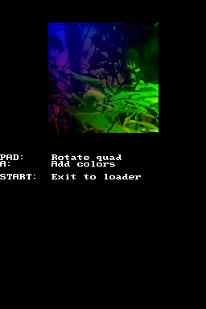

## 8. Texture formats

The DS supports 7 texture formats, and 6 of them use palettes. Now that we know
how to load and use textures that don't need palettes we can start to think
about formats that require palettes.

- `GL_RGBA`: 16 bit textures: 5 bits for each one of the RGB components, 1 bit
  for alpha (2 bytes per pixel). It doesn't use palettes.

  You may see some code that uses `GL_RGB`. It is the same format internally,
  but `glTexImage2D()` sets the alpha bit to 1 internally (which takes CPU
  time!). This alias can be useful if your graphics conversion program doesn't
  set the alpha bit correctly, but it's generally better to set it to 1 manually
  before calling `glTexImage2D()`,

  Sample grit arguments:

  ```sh
  # 16 bit texture bitmap, force alpha bit to 1
  -gx -gb -gB16 -gT!
  ```

  ```sh
  # 16 bit texture bitmap, set magenta as transparent color
  -gx -gb -gB16 -gTFF00FF
  ```

- `GL_RGB256`, `GL_RGB16` `GL_RGB4`: Textures with 256, 16 or 4 color palettes.
  Each color in the palette uses 5 bits for each one of the RGB components (but
  the last bit isn't the alpha bit!). Option `GL_TEXTURE_COLOR0_TRANSPARENT`
  lets you define index 0 as transparent or not (we'll see how to later). The
  formats use 1 byte per pixel, 4 bits per pixel, and 2 bits per pixel
  respectively.

  Sample grit arguments:

  ```sh
  # 256-color (8 bits per pixel) texture, set magenta as transparent color
  -gx -gb -gB8 -gTFF00FF
  ```

  ```sh
  # 16-color (4 bits per pixel) texture, set black as transparent color
  -gx -gb -gB4 -gT000000
  ```

  ```sh
  # 4-color (2 bits per pixel) texture, set magenta as transparent color
  -gx -gb -gB2 -gTFF00FF
  ```

- `GL_RGB32_A3` and `GL_RGB8_A5`: They are translucent palettes in which you're
  allowed to set a different translucency value (alpha value) per pixel. They
  have 32 color and 8 color palettes respecively. This only uses 5 and 3 bits
  of a byte, and the remaining bits are used as alpha value for that pixel. We
  will see how to use the two formats later when we discuss alpha blending.
  Alpha blending requires some special handling (regular on/off transparency,
  like in the other formats, doesn't need any special handling).

  Sample grit arguments:

  ```sh
  # 5 bits of alpha, 3 bits of color index
  -gx -gb -gBa5i3 -gT!
  ```

  ```sh
  # 3 bits of alpha, 5 bits of color index
  -gx -gb -gBa3i5 -gT!
  ```

- `GL_COMPRESSED`: This is a special format. It splits the texture into blocks
  of 4x4 pixels and compresses the texture by sharing textures between different
  4x4 blocks. The actual details of the format aren't important, but you can see
  them [here](https://problemkaputt.de/gbatek.htm#ds3dtextureformats) if you're
  interested. This format is also called tex4x4 in some tools.

  This format uses a fixed amount of space for the texture itself (3 bits per
  pixel of texture memory) plus a variable amount of palette memory. The palette
  is where conversion tools can try to save space. Also, pixels can be made
  transparent.

  This format isn't good for textures that have a lot of details. Think of it as
  the JPEG format of the DS. Use it for natural-looking textures.

  You need to use ptexconv to convert images to this format, grit doesn't
  support it. Check [this link](../../../docs/libs/tools) for information on how
  to install it. We'll see this in more detail later.

Let's see how to load paletted textures.

1. Assign some VRAM memory to be used for texture palettes:

   ```c
   vramSetBankF(VRAM_F_TEX_PALETTE);
   ```

   Banks F (64 KiB), G (16 KiB) and H (16 KiB) can be used for texture palettes.

2. Generate a texture ID with `glGenTextures()` and bind with `glBindTexture()`
   as explained before.

3. Load the texture specifying the right format. How you also need to decide if
   color with index 0 is transparent or not. If you want it to be transparent,
   add `GL_TEXTURE_COLOR0_TRANSPARENT` to the texture parameters. Note that this
   setting doesn't work with `GL_RGBA` and `GL_COMPRESSED` formats.

   ```c
    if (glTexImage2D(0, 0, GL_RGB256, 64, 64, 0,
                     TEXGEN_TEXCOORD | GL_TEXTURE_COLOR0_TRANSPARENT,
                     statueBitmap) == 0)
    {
        printf("Failed to load texture\n");
        wait_forever();
    }
    ```

4. Load the palette specifying the format and size. This function will look for
   all VRAM banks assigned as texture palette VRAM and it will try to allocate
   the data there. It will ignore banks assigned to other types of data.

   ```c
   if (glColorTableEXT(0, 0, statuePalLen / 2, 0, 0, statuePal) == 0)
   {
       printf("Failed to load palette\n");
       wait_forever();
   }
   ```

The following example shows how to do this in practice:
[`examples/graphics_3d/paletted_textures`](https://github.com/blocksds/sdk/tree/master/examples/graphics_3d/paletted_textures).
Note how the texture is loaded twice. On the left it's displayed with color 0
set as transparent. On the right it's displayed with color 0 set as opaque:

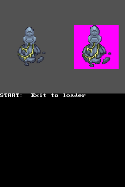

## 9. Compressed textures

Compressed textures are a bit special. Instead of having two parts (texture data
and palette data) they have three: texel blocks, palette indices and palette
data.

The three parts need to be loaded to different locations in VRAM:

- Texel blocks can be stored in texture slots 0 or 2 (in libnds they are
  normally VRAM A and VRAM C).
- Palette indices are stored in texture slot 1 (VRAM B).
- Palette data is stored in palette VRAM.

Some tools (like ptexconv) generate 3 different files. Other tools only generate
two (the first two parts are concatenated and saved as a single file). This is
possible because the texel blocks data is always double the size as the palette
indices data (the palette data can have any arbitrary size, so it's always
stored separately).

`glTexImage2D()` expects the texel blocks and palette indices to be provided as
one single file. You can concatenate them manually before adding them to the
data folder of your game or you can concatenate them at runtime, the choice is
yours.

You can check the following example:
[`examples/graphics_3d/compressed_texture`](https://github.com/blocksds/sdk/tree/master/examples/graphics_3d/compressed_texture).

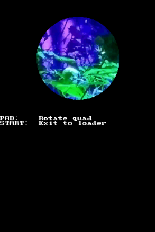

The main difference is the fact that you need to use ptexconv to convert the
texture. This example comes with a shell script with the following command:

```sh
$BLOCKSDSEXT/ptexconv/ptexconv \
    -gt -ob -k FF00FF -v -f tex4x4 \
    -o data/neon \
    assets/neon.png
```

This generates a texture with magenta as transparent color of tex4x4 format. The
output files are `neon_tex.bin` (texel blocks), `neon_idx.bin` (palette indices)
and `neon_pal.bin` (palette data). Then, the script concatenates the files:

```sh
cat data/neon_tex.bin data/neon_idx.bin > data/neon_combined.bin
rm data/neon_tex.bin data/neon_idx.bin
```

The actual code that loads the texture and the palette are the same as for all
other textures with palettes:

```c
if (glTexImage2D(0, 0, GL_COMPRESSED, 128, 128, 0, TEXGEN_TEXCOORD, neon_combined_bin) == 0)
{
    printf("Failed to load texture\n");
    wait_forever();
}

if (glColorTableEXT(0, 0, neon_pal_bin_size / 2, 0, 0, neon_pal_bin) == 0)
{
    printf("Failed to load palette\n");
    wait_forever();
}
```

## 10. Final notes about textures

### 10.1 Edge texture modes

When you draw textured polygons you normally use coordinates that fit inside the
texture. For example, if your texture size is 64x64 pixels, your texture
coordinates go from 0 to 63. However, you're allowed to send values that are
outside of those bounds (negative, or bigger than 63).

You can decide the behaviour in that case when you load a texture with
`glTexImage2D()`:

- Clamp them to the texture size (default setting).
- Wrap the coordinates and repeat the texture: `GL_TEXTURE_WRAP_S` and
  `GL_TEXTURE_WRAP_T`.
- Wrap the coordinates and flip the texture. You need to use the previous flags
  and the flip flags `GL_TEXTURE_FLIP_S` and `GL_TEXTURE_FLIP_T`.

Check the following example:
[`examples/graphics_3d/texture_edge_modes`](https://github.com/blocksds/sdk/tree/master/examples/graphics_3d/texture_edge_modes).

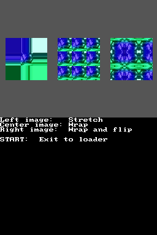

### 10.2 Texture matrix

Apart from the projection and model view matrices you can use the texture
matrix. This texture can be used to achieve transformation effects without
having to calculate the texture coordinates by hand.

This tutorial won't get into many details, it will only show a simple example of
using it:

Check the following example:
[`examples/graphics_3d/texture_matrix`](https://github.com/blocksds/sdk/tree/master/examples/graphics_3d/texture_matrix).

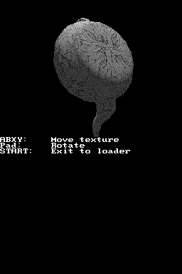

The important things to consider are:

- The effect of the texture matrix depends on how you load textures. For
  example, in this case we use `TEXGEN_TEXCOORD` and we enable texture wrap
  because we are going to make the texture loop to create that effect.

  ```c
  if (glTexImage2D(0, 0, GL_RGBA, 256, 256, 0,
                   TEXGEN_TEXCOORD | GL_TEXTURE_WRAP_S | GL_TEXTURE_WRAP_T,
                   teapotBitmap) == 0)
  ```

- You need to setup the texture matrix. In this example we do a simple
  translation. The effect of the example appears because the texture coordinates
  of the model follow a spherical pattern. They start on the bottom of the
  teapot.

  ```c
  glMatrixMode(GL_TEXTURE);
  glLoadIdentity();
  glTranslatef32(tx << 10, ty << 10, 0);
  ```

You can check [GBATEK](https://problemkaputt.de/gbatek.htm#ds3dtextureattributes)
for all the details, but this is the short version:

- `TEXGEN_OFF`: Ignore the texture matrix.
- `TEXGEN_TEXCOORD`: Multiply texture coordinates by the texture matrix.
- `TEXGEN_NORMAL`: Set texture coordinates equal to normal * texture matrix,
  used for spherical reflection mapping.
- `TEXGEN_POSITION`: Set texture coordinates equal to vertex * texture matrix.

### 10.3 Sharing palettes between textures

If you want to use the same palette in more than one texture you can use
function `int glAssignColorTable(int target, int name)`. It will take the
palette of `name` and assign it to `target`. The palette will only be deleted
from VRAM when all the textures that use it are deleted.

### 10.4 Live editing of textures

Live editing of palettes is very useful:

- You can edit textures and palettes to create special effects, like palette
  loop effects.

- You can use them to delay loading of textures and palettes. If you pass a
  `NULL` data pointers to `glTexImage2D()` or `glColorTableEXT()` and they will
  allocate space in VRAM, but not copy anything there. You can load data later
  with this system.

There are a few functions that take a texture ID as argument and return a
pointer to the address in VRAM of the requested data:

- `glGetTexturePointer()`: Address of the texture data.
- `glGetTextureExtPointer()`: Address of the palette indices data (only
  `GL_COMPRESSED` textures).
- `glGetColorTablePointer()`: Address of the palette data.

Unfortunately, texture and palette data can't be accessed right away. You need
to switch the VRAM banks to LCD mode, edit the data, and switch back to the
previous mode. And you need to do this quickly because the GPU needs the VRAM
banks to be set to texture or texture palette mode to be able to use them. The
process to do this correctly is:

- Setup a VBL handler with your texture/palette editting code.
- In the handler, call the `glGet*Pointer()` function to get the pointer to the
  data you want to edit.
- Set the banks to LCD mode. For example, call `vramSetBankA(VRAM_A_LCD)` if
  you have assigned VRAM bank A as texture VRAM, or `vramSetBankF(VRAM_F_LCD)`
  if you have assigned VRAM bank F for palettes.
- Edit the data.
- Call `vramSetBankA(VRAM_A_TEXTURE)` or `vramSetBankF(VRAM_F_TEX_PALETTE)` as
  required.

You don't even have the full vertical blanking period to do the modifications.
The GPU starts to render lines 48 scanlines before the end of the vertical
blanking period (documentation [here](https://problemkaputt.de/gbatek.htm#ds3doverview)
and [here](https://problemkaputt.de/gbatek.htm#ds3dstatus)).

Vertical blanking starts in scanline 192, and 3D rendering starts in scanline
214. At that point, the GPU starts rendering lines and storing them in a buffer
that can hold up to 48 lines (you can check the current status by reading
`GFX_RDLINES_COUNT`). The actual screen output starts after scanline 262. In
practice, you only have 22 scanlines to upload data to VRAM. If you don't make
it in time, the GPU will read white pixels from VRAM.

### 10.5 Obtaining the size of the active texture

If you want to know the dimensions of the active texture you can do it like
this:

```c
int width = 0;
int height = 0;
glGetInt(GL_GET_TEXTURE_WIDTH, &width);
glGetInt(GL_GET_TEXTURE_HEIGHT, &height);
```

## 11. Alpha blending (translucency)

There are two ways to draw polygons that aren't fully opaque:

- Setting the polygon alpha value with `glPolyFmt()` and `POLY_ALPHA()`.
- Using the translucent textures formats `GL_RGB32_A3` and `GL_RGB8_A5`.

### 11.1 Per-polygon alpha value

You can create translucency effects by setting an alpha value between 1 and 30
to polygons. Check the following example:
[`examples/graphics_3d/translucent_polygon`](https://github.com/blocksds/sdk/tree/master/examples/graphics_3d/translucent_polygon).

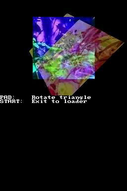

In this example there is only one opaque polygon and one translucent polygon, so
we don't need to worry about the order in which we draw them. That will become a
problem when we start drawing multiple translucent polygons.

In this very easy example all we need to do is to enable alpha blending:

```c
glEnable(GL_BLEND);
```

And set the alpha blending for the polygons to be drawn next:

```c
glPolyFmt(POLY_ALPHA(15) | POLY_CULL_NONE);
```


A value of 0 doesn't make the polygon fully transparent, it enables wireframe
mode. In that mode only the outline of polygons is drawn. To hide polygons,
don't draw them at all.


### 11.2 Translucent textures

The previous system restricts you to one single alpha value per polygon. Using
translucent textures allows you to specify up to 8 levels of transparency with
`GL_RGB32_A3` or 32 levels with `GL_RGB8_A5`.

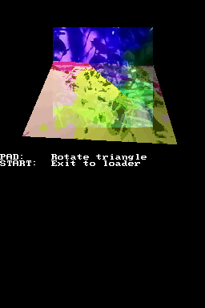

The code of the example is here:
[`examples/graphics_3d/translucent_texture`](https://github.com/blocksds/sdk/tree/master/examples/graphics_3d/translucent_texture).

In this case you also need to enable alpha blending:

```c
glEnable(GL_BLEND);
```

The rest of the work involves creating a PNG file with an alpha channel. When
you convert it with grit, it will use that channel to generate the translucency
values of `GL_RGB32_A3` and `GL_RGB8_A5` textures. You need to use the following
parameters for grit:

```sh
# 5 bits of alpha, 3 bits of color index
-gx -gb -gBa5i3 -gT!
```

```sh
# 3 bits of alpha, 5 bits of color index
-gx -gb -gBa3i5 -gT!
```

### 11.3 Multiple translucent objects

So far we have only seen how to display translucent polygons on top of opaque
polygons. This is easy and you don't really need to do anything special. Opaque
polygons are drawn before translucent polygons, so they get naturally sorted by
themselves. However, if you want to draw translucent polygons on top of others
you need to manage polygon IDs.

We have ignored this so far, but `glPolyFmt()` can take a polygon ID (0 to 63)
with `POLY_ID()`. The clear plane also has its own polygon ID, which can be set
with `glClearPolyID()`. Polygon IDs are important for anti-aliasing and polygon
outlines, we will see them later.

Translucent polygons that belong to the same object (and don't blend with each
other) can have the same polygon ID. Polygons that are meant to overlap other
translucent polygons need to have different IDs.

However, the hardest part is that you need to draw all the translucent objects
in the right order (for now, ignore the part of the code that sorts the objects
by distance, we will see how to do that later). Polygons that are far away from
the camera need to be drawn first. Polygons closer to the camera need to be
drawn last. Also, you need to do this to finish the frame:

```c
glFlush(GL_TRANS_MANUALSORT);
```

If you don't pass this value, it will sort polygons by their Y coordinate, which
probably isn't what you want.

This example takes everything into consideration to draw a few translucent
balls: [`examples/graphics_3d/sort_translucent_objects`](https://github.com/blocksds/sdk/tree/master/examples/graphics_3d/sort_translucent_objects).

The following image shows the regular output of this example when balls are
ordered correctly (left) and when they are sorted in reverse (right):

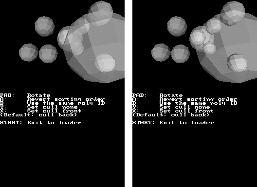

In this example each ball has its own polygon ID. The following image compares
the output when all balls have different IDs (left) and when they all share the
same ID (right):

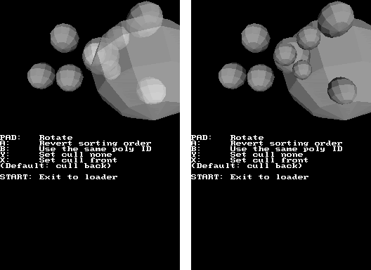

You also need to consider culling when drawing objects that are translucent.
Normally you only want to see the camera-facing polygons of the translucent
objects (left), but you can also correctly display the back-facing polygons
(right):

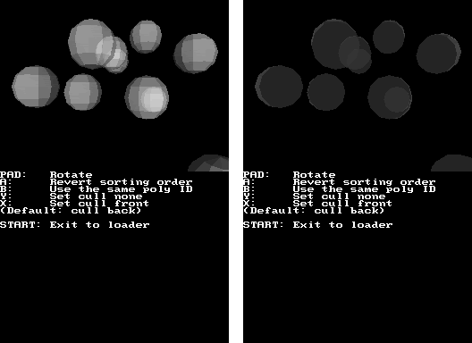

If you want to see both sets of polygons you can't just disable culling:

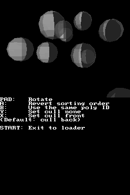

The problem here is that polygons are drawn in an order that isn't back to
front. You need to sort the polygons inside each object, which may not be
possible at all if you are using display lists (as we will see later).

A trick you can use is to render the objects twice:

- First, with front culling, so that the back-facing polygons are rendered.
- Second, with back culling, so that the camera-facing polygons are rendered.

Also, you need to sort the objects as well. For example, in the case of the
balls, you need to draw each ball twice as described, and then start drawing the
next ball. You can't draw all balls with front culling and then all balls with
front culling.

This is a bit complicated to see in an example with so many objects, so let's
show it in an easier example with just one cube:
[`examples/graphics_3d/translucent_cube`](https://github.com/blocksds/sdk/tree/master/examples/graphics_3d/translucent_cube).

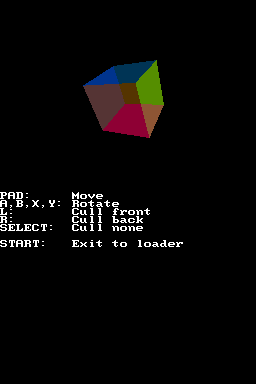

This is the important part of the code. You can see how we draw the back-facing
polygons first with 0 as polygon ID, and then the front-facing polygons with 1
as polygon ID:

```c
glPolyFmt(POLY_ALPHA(10) | POLY_ID(0) | POLY_CULL_FRONT);

draw_box(-0.75, -0.75, -0.75,
         0.75, 0.75, 0.75);

glPolyFmt(POLY_ALPHA(10) | POLY_ID(1) | POLY_CULL_BACK);

draw_box(-0.75, -0.75, -0.75,
         0.75, 0.75, 0.75);
```

Remember to tell the hardware that we have sorted translucent polygons manually:

```c
glFlush(GL_TRANS_MANUALSORT);
```

### 11.4 Alpha test

The alpha test is an interesting feature that lets you setup a threshold of the
minimum alpha value that is rendered. If the threshold is 0, pixels with all
alpha values are drawn. If the threshold is 10, only alpha values 11 to 31 are
drawn. If the threshold is 31, all alpha values are hidden (even opaque
polygons!).

The left image shows the effect of a threshold of 11, the right one has a
threshold of 25. You can see that a lot more of the translucent texture is
hidden:

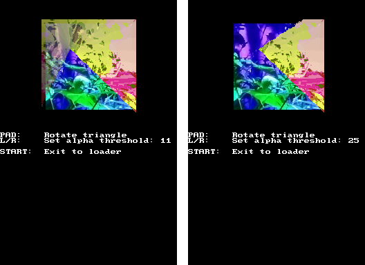

To do this, you have to enable the feature and set the threshold you want:

```c
glEnable(GL_ALPHA_TEST);
glAlphaFunc(25);
```

You can check the code of the example here:
[`examples/graphics_3d/alpha_test`](https://github.com/blocksds/sdk/tree/master/examples/graphics_3d/alpha_test)

## 12. Orthogonal and perspective projections

So far we have only seen perspective projections in this chapter. With this kind
of projections, polygons get closer to each other on the screen as they get
further away from the camera. This is how things work normally. The same depth
that is used to determine which polygons are in front is used to transform the
coordinates of the vertices.

However, it is also possible to setup a projection where depth doesn't affect
the coordinates of the vertices (and only decide which polygons are in front of
the rest).

Projections like this one are called "orthogonal" projections. This image shows
a regular perspective projection on the left and an orthogonal projection on
the right:


You can check the code of the example here:
[`examples/graphics_3d/ortho_projection`](https://github.com/blocksds/sdk/tree/master/examples/graphics_3d/ortho_projection)

This is the important part of the example:

```c
glMatrixMode(GL_PROJECTION);
glLoadIdentity();

if (keys & KEY_SELECT)
    gluPerspective(70, 256.0 / 192.0, 0.1, 40);
else
    glOrtho(-3, 3, -2, 2, 0.1, 100);
```

Note that this example uses `gluPerspective()` instead of `gluLookAt()`. They
are both useful, and you should pick one or the other based on the kind of
parameters you want to define.

The perspective projection has a field of view angle of 70 degrees (in the Y
direction, side to side), an aspect ratio of 256 / 192. The near Z plane is at
0.1, and the far Z plane at 40.0. Only polygons located between both planes are
drawn.

The orthogonal projection is setup so that the left and right bounds are -3 and
3, the bottom and top bounds are -2 and 2, and the Z planes are 0.1 and 100.

Orthogonal projections are very useful to draw 2D graphics like a user
interface. It's also used internally by GL2D.

Function `glBeing2D()` sets a projection where the bounds are set to the size of
the screen, something like this:

```c
glOrthof32(0, SCREEN_WIDTH, SCREEN_HEIGHT, 0, -inttof32(1), inttof32(1));
```

The actual code used by the function is a bit more complicated because it's
designed to work around some accuracy issues. Because of that, you should use
GL2D if you are trying to draw 2D elements in your 3D scene instead of setting
up the projection yourself.

You can check the code
[here](https://github.com/blocksds/libnds/blob/9eaccbc45b46fd20a41e0e3d32bc6c0a1364d553/source/arm9/video/gl2d.c#L68-L108)
if you're curious about the issue and how it's fixed.

## 13. Display lists

Until now we have seen how to send commands to the GPU manually one by one, but
this isn't the most efficient way to send commands to the GPU. The GPU can also
receive packed commands, and it's possible to setup a DMA copy that sends a list
of packed commands to the GPU very efficiently.

Normally you don't create display lists by hand (there are tools that convert
popular 3D model formats into display lists) but it's a good idea to know how
they are created, so let's see a sample display list:

```c
const uint32_t display_list[] =
{
    13,

    FIFO_COMMAND_PACK(FIFO_BEGIN, FIFO_COLOR, FIFO_VERTEX16, FIFO_COLOR),
        // FIFO_BEGIN
        GL_QUADS,
        // FIFO_COLOR
        RGB15(31, 0, 0),
        // FIFO_VERTEX16
        VERTEX_PACK(inttov16(-1), inttov16(-1)),
        VERTEX_PACK(0, 0),
        // FIFO_COLOR
        RGB15(0, 31, 0),

    FIFO_COMMAND_PACK(FIFO_VERTEX_XY, FIFO_COLOR, FIFO_VERTEX_XY, FIFO_COLOR),
        // FIFO_VERTEX_XY
        VERTEX_PACK(inttov16(1), inttov16(-1)),
        // FIFO_COLOR
        RGB15(0, 0, 31),
        // FIFO_VERTEX_XY
        VERTEX_PACK(inttov16(1), inttov16(1)),
        // FIFO_COLOR
        RGB15(31, 31, 0),

    FIFO_COMMAND_PACK(FIFO_VERTEX_XY, FIFO_END, FIFO_NOP, FIFO_NOP),
        // FIFO_VERTEX_XY
        VERTEX_PACK(inttov16(-1), inttov16(1)),
        // FIFO_END and FIFO_NOP don't have parameters
};
```

This code is used to display a colored quad, and it's taken from
[`examples/graphics_3d/display_list_creation`](https://github.com/blocksds/sdk/tree/master/examples/graphics_3d/display_list_creation).

A display list is a simple array of 32-bit elements that contains commands and
parameters (the indentation is different for the parameters elements so that
it's easier to understand the code).

- The first word of the display list is the size (in words) of the display list,
  excluding the size itself. This value isn't a part of the display list itself,
  but it's used by libnds to know how much data to send to the GPU.

- Next, there is a word which is a block of 4 packed GPU commands (like
  `glBegin()`, `glColor()`, `glVertex()`, ...). There are some helper defines in
  libnds [here](https://github.com/blocksds/libnds/blob/173c19c9ee26ffc137e61b035a1fb83a8e11f64b/include/nds/arm9/videoGL.h#L380-L412).

- After each word with commands you need to add words with the parameters that
  each command needs. If a command needs more than one parameter, it must be
  split into multiple words (like `FIFO_VERTEX16`, which needs to be split into
  two). Some commands don't take any parameter, like `FIFO_END`.

- Create a new word with commands and repeat until the last command is used.
  The last word with commands can be padded with `FIFO_NOP` commands (they don't
  take any parameter).

Once you have your display list ready you can call `glCallList(display_list)`
and all the commands will be sent to the GPU.

This system of sending commands to the GPU is great to draw complex models
because you don't need to use any CPU time to send individual commands. You can
send any command to the GPU with a display list (but normally you only send the
commands needed to draw models).

Normally you will create 3D models in a tool like Blender, export it as some
format like Wavefront OBJ, use some tool to convert it to a display list, and
add the display list to your game as data.

The following example has a `convert.sh` script that uses a conversion tool from
[Nitro Engine](https://github.com/AntonioND/nitro-engine/tree/master/tools/obj2dl).
This script takes the OBJ file and it generates a BIN file that is added to the
game.

[`examples/graphics_3d/display_list_teapot`](https://github.com/blocksds/sdk/tree/master/examples/graphics_3d/display_list_teapot).

Also, remember the wireframe mode that we mentioned in the chapter about
translucency? This is a perfect time to show it in action! The following images
show the output of that example. The left image displays the model as normal,
and the one on the right displays it in wireframe mode (which doesn't work in
all emulators):

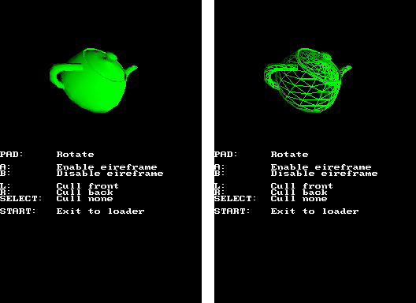

This system can even be used to draw animated models, but that's more advanced,
and we will see how to do it in a future chapter.

## 14. Using lighting

### 14.1 Introduction

The DS allows you to setup up to 4 sources of directional light. They behave
like the sun:

- All rays of light are parallel.
- Light sources don't have a defined position because they are "infinitely" far
  away.

You can see an example here:
[`examples/graphics_3d/lighting_cube`](https://github.com/blocksds/sdk/tree/master/examples/graphics_3d/lighting_cube)

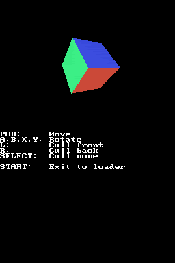

This cube doesn't have textures or color. It's illuminated by three lights (red,
green and blue) that have different directions.

In order to use them you need to define some material properties first (we will
explain them better later):

```c
glMaterialf(GL_AMBIENT, RGB15(8, 8, 8));
glMaterialf(GL_DIFFUSE, RGB15(24, 24, 24));
glMaterialf(GL_SPECULAR, RGB15(0, 0, 0));
glMaterialf(GL_EMISSION, RGB15(0, 0, 0));
```

Then you need to setup the color and direction of the lights:

```c
glLight(0, RGB15(31, 0, 0), floattov10(-0.71), floattov10(0.71), floattov10(0));
glLight(1, RGB15(0, 31, 0), floattov10(0.71), floattov10(0), floattov10(-0.71));
glLight(2, RGB15(0, 0, 31), floattov10(0), floattov10(-0.71), floattov10(-0.71));
```


The directions used for lighting must be unit vectors.



Light directions are transformed by the model view matrix but not by the
projection matrix.


Before drawing your polygons you need to specify the lights that affect them:

```c
glPolyFmt(POLY_ALPHA(31) | POLY_CULL_BACK | POLY_FORMAT_LIGHT0 |
          POLY_FORMAT_LIGHT1 | POLY_FORMAT_LIGHT2);
```

And you need to use normal commands while you draw your polygons. Normal
commands look away from the polygon:

```c
glNormal3f(1, 0, 0);

glVertex3v16(0, 1, 0);
glVertex3v16(0, 1, 1);
glVertex3v16(0, 0, 1);
```

Normal commands overwrite color commands, and color commands overwrite normal
commands, you can't use both at the same time.


As mentioned [here](https://melonds.kuribo64.net/board/thread.php?id=141), the
fastest way to send commands to the GPU is to send commands in the order
"normal, texture coordinate, vertex", not "texture coordinate, normal, vertex".


### 14.2 Material types

The DS has 4 different material properties. You need to define a color for each
material type, and they define how light behaves on the polygons drawn
afterwards.

- Diffuse: This is "normal" light. It is more intense in polygons that face
  towards light sources, and it behaves how you would expect a mate object
  behave.

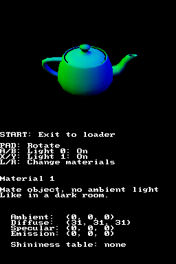

- Ambient: This is is light that illuminates the object uniformly. Essentially,
  it's a base level of light for all vertices. It's only applied if there are
  active lights in the room. If all lights are disabled, the ambient component
  will be black.

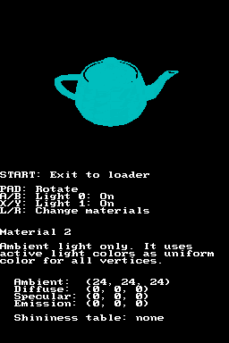

- Specular: It has a metallic feel. You can also enable a shinyness table you
  can fill with your own values. If the table is disabled it behaves as a linear
  table. Function `glMaterialShininess()` of libnds also sets a linear table to
  it. You may want to set a different table of values if you want other effects.

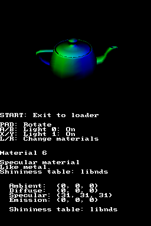

- Emission: This is the base color of the object independent from any light. It
  is added to the polygons even if all lights are disabled. It isn't affected by
  the color of the lights.

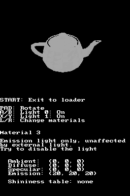

You can check the source code of the example here:
[`examples/graphics_3d/lighting_materials`](https://github.com/blocksds/sdk/tree/master/examples/graphics_3d/lighting_materials)

If you want to use the shininess table, you'll need to define your `GL_SPECULAR`
material like this:

```c
glMaterial(GL_SPECULAR, RGB(31, 31, 31) | GL_SPECULAR_USE_TABLE);
```

You can use `glMaterialShininess()` to setup a linear table, or you can setup
your own table like this, for example:

```c
uint32_t table[128 / 4];
uint8_t *bytes = (uint8_t *)table;

// Cubic function
for (int i = 0; i < 128; i++)
{
    int v = i * i * i;
    int div = 128 * 128;
    bytes[i] = v * 2 / div;
}

for (int i = 0; i < 128 / 4; i++)
    GFX_SHININESS = table[i];
```

If you want a full explanation of how materials work, check
[GBATEK](https://problemkaputt.de/gbatek.htm#ds3dpolygonlightparameters).
Section "Internal Operation on Normal Command" explains the behaviour:

```
IF TexCoordTransformMode = 2 THEN
    TexCoord = NormalVector * Matrix (see TexCoord)

NormalVector = NormalVector * DirectionalMatrix
VertexColor = EmissionColor

FOR i = 0 to 3
    IF PolygonAttrLight[i] = enabled THEN
        DiffuseLevel = max(0, -(LightVector[i] * NormalVector))
        ShininessLevel = max(0, (-HalfVector[i]) * (NormalVector)) ^ 2
        IF TableEnabled THEN
            ShininessLevel = ShininessTable[ShininessLevel]

        # Colors are processed separately for the R,G,B color components
        VertexColor = VertexColor + SpecularColor * LightColor[i] * ShininessLevel
        VertexColor = VertexColor + DiffuseColor * LightColor[i] * DiffuseLevel
        VertexColor = VertexColor + AmbientColor * LightColor[i]
    ENDIF
NEXT i
```

### 14.3 Toon shading

Toon shading is a very easy effect you can use to display 3D objects with a
cartoon-like effect. Instead of treating light changes gradually it lets you
define your own behaviour. For example, you can define a behaviour in which the
table only has two values (light on, light off) to give your objects an aspect
similar to how cartoons are drawn.

The image on the left shows a teapot with toon shading enabled, the image on the
right shows the same teapot with regular (decal) shading.

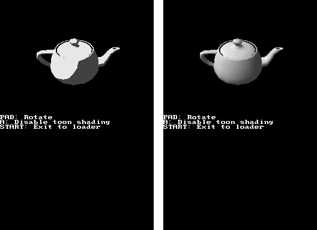

The code of this example can be found here:
[`examples/graphics_3d/toon_shading`](https://github.com/blocksds/sdk/tree/master/examples/graphics_3d/toon_shading)

Toon shading works by treating the output of the lights calculation as an entry into a
shading table. You need to define the values of the entries in the table.

In this example we define two ranges of values:

- The first range (0 - 15) is for pixels with less than half the maximum light
  intensity (shaded areas).
- The second one (16 - 31) is for pixels that have over half the maximum light
  intensity (areas facing the light).

```c
glSetToonTableRange(0, 15, RGB15(8, 8, 8));
glSetToonTableRange(16, 31, RGB15(28, 28, 28));
```

You also need to change the shading mode in `glPolyFmt()`:
```c
glPolyFmt(POLY_ALPHA(31) | POLY_CULL_BACK | POLY_FORMAT_LIGHT0 | POLY_TOON_HIGHLIGHT);
```

Normal shading can be enabled with `POLY_MODULATION` (this one is the default).

### 14.4 Modulation and decal polygon modes

Modulation mode (`POLY_MODULATION`) is the default mode used to render polygons.
This mode behaves the way you expect them to behave:

- Translucent polygons and translucent areas of textures are translucent.
- Lights change the color of the textures used to draw polygons.

However, there's another mode called decal mode (`POLY_DECAL`), and it behaves
in a very different way:

- Translucent polygons and translucent areas of textures behave like white
  textures that are affected by light.
- Lights **don't** change the color of the textures used to draw polygons.

This is easier to see with an example:

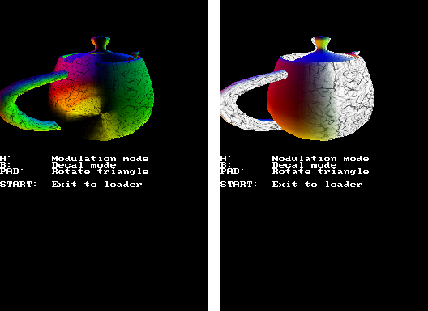

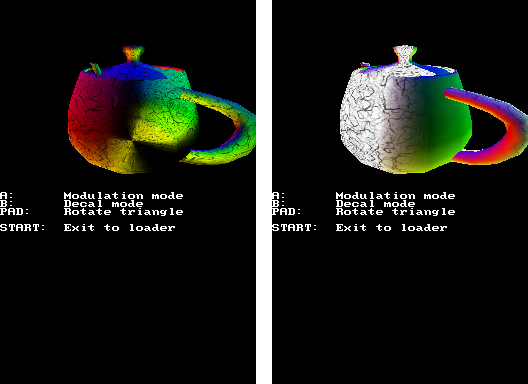

The code of this example can be found here:
[`examples/graphics_3d/modulation_vs_decal`](https://github.com/blocksds/sdk/tree/master/examples/graphics_3d/modulation_vs_decal)

There's more information about how the two modes work
[in GBATEK](https://problemkaputt.de/gbatek.htm#ds3dtextureblending).

## 15. Combining 2D and 3D on the same screen

Sometimes it can be useful to combine 2D backgrounds of sprites and 3D graphics
on the same screen. For example:

- You may want to display a 2D player interface over the 3D scene. You can do it
  with the 3D hardware by sending a few polygons to the GPU, but you can also
  setup a 2D background layer to be drawn on top of the 3D output and you won't
  need to worry about drawing it every frame.

- If you're creating a 2D game using GL2D, you may want to use a 2D background
  under the GL2D graphics. Drawing a tiled background using the 3D hardware
  needs hundreds of polygons, which takes a lot of CPU time and GPU resources. A
  2D tiled background is basically free for the CPU and GPU.

The most important things to remember are:

- The 3D output replaces background layer 0 of the main graphics engine.

- The 3D output has its own alpha channel. If you want to display 2D graphics
  under the 3D output, you need to ensure that the 3D output doesn't make all
  pixels opaque.

### 15.1 2D over 3D

In practice, all you need to do is to reduce the priority of background layer 0
and increase the priority of some other layers that you want on top of it.
Sprites have a higher priority than backgrounds by default, so you don't need to
worry about them.

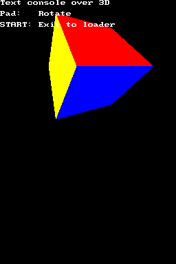

The code of this example can be found here:
[`examples/graphics_3d/text_over_3d`](https://github.com/blocksds/sdk/tree/master/examples/graphics_3d/text_over_3d)

First, you need to set the right video mode. The mode affects background layers
1, 2 and 3 (layer 0 is used for the 3D output):

```c
videoSetMode(MODE_0_3D);
```

Now, setup your 2D layers. In this example all we're doing is setting up the
text console, so we need to allocate some VRAM for main engine background and
setup background layer 1 as a console layer:

```c
vramSetBankF(VRAM_F_MAIN_BG_0x06000000);
consoleInit(NULL, 1, BgType_Text4bpp, BgSize_T_256x256, 7, 0, true, true);
```

Finally, set the priorities of the background layers so that the console has a
higher priority than the 3D output (lower numbers have a higher priority):

```c
// Set layer 0 (3D layer) to priority 1
bgSetPriority(0, 1);

// Set layer 1 (console) to priority 0
bgSetPriority(1, 0);
```

### 15.2 3D mixed with 2D

The main thing you need to consider is that the clear plane has to be
transparent if you want to see anything under the 3D output. Set the alpha (the
last argument) to zero:

```c
glClearColor(0, 0, 0, 0);
```


Making the clear plane transparent disables antialiasing between the edges of
polygons and the clear plane.


This is an example of how to display 2D sprites and backgrounds and 3D polygons
at the same time:

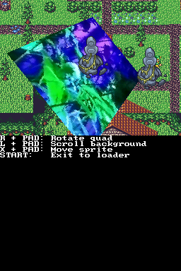

The code of this example can be found here:
[`examples/graphics_3d/2d_and_3d`](https://github.com/blocksds/sdk/tree/master/examples/graphics_3d/2d_and_3d)

## 16. Fog

The DS supports a fog effect that can be very useful in games:

- It can be used as a simple visual effect to make the game graphics more
  beautiful. For example, black fog can be used to simulate the darkness in a
  night 3D environment.

- It can be used to hide objects as they move far away from the camera so that
  they can be unloaded without popping. For example, a blue fog could be used in
  a sea environment to make distant islands fade away in a 3D environment.

- It can be used to make 3D objects become more and more translucent as they get
  far away and blend them over a 2D background.

The first two scenarios use the fog "color + alpha" mode, and the last one uses
the "only alpha" mode.

### 16.1 Color fog

This is an example of the effect:
[`examples/graphics_3d/fog`](https://github.com/blocksds/sdk/tree/master/examples/graphics_3d/fog)

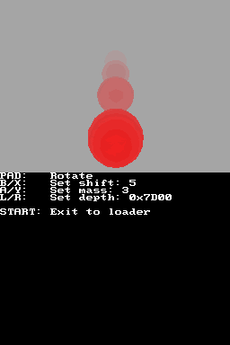

It's quite easy to use it, but it needs a bit of trial and error to configure
it. First, enable it and define the fog color (for now, let's make the alpha 31
to make the fog fully opaque):

```c
glEnable(GL_FOG);

glFogColor(20, 20, 20, 31); // R, G, B, A
```

You need to decide if the fog will be added to the clear plane or not. If you're
showing 2D layers behind the 3D graphics you will need to disable it, for
example. If not, the fog will be used as clear color.

```c
glClearFogEnable(true);
```

You also need to define the parameters of the fog for this example:

- Offset: Distance from the camera where the fog starts having an effect on
  polygons. In this example, that's the `offset` variable.
- Shift: Defines the distance between different entries of the fog table. In
  this example, that's the `shift` variable.
- Fog density table: Values that define how the fog increases as distance
  increases. In this example, `mass` is a constant that gets added to the
  density of the previous entry in the table to create a linear fog density
  table.

```c
// How much depth difference there is between table entries
glFogShift(shift);

// Depth at which the fog starts (and the table starts applying)
glFogOffset(depth);

// Generate a linear density table

int density = 0; // Start table at 0

for (int i = 0; i < 32; i++) // It has 32 steps
{
    glFogDensity(i, density);

    density += mass << 1;

    // Entries are 7 bit, so cap the density to 127
    if (density > 127)
        density = 127;
}
```

The example in the previous link lets you experiment with different values for
each of the parameters. You will probably need to do the same in your game.

The last step is allowing fog to be displayed on top of polygons. You can select
which polygons are affected and which ones are not. For example, a skybox
shouldn't be affected by the fog.

```c
glPolyFmt(POLY_ALPHA(31) | POLY_CULL_BACK | POLY_FOG);
```

### 16.2 Alpha fog

This is an example of the effect:
[`examples/graphics_3d/fog_over_2d`](https://github.com/blocksds/sdk/tree/master/examples/graphics_3d/fog_over_2d)

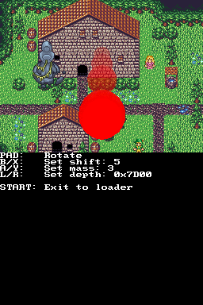

This example involves the 2D and 3D hardware and it's a bit trickier to setup.

Enable fog and alpha blending so that fog can blend on the 2D layers.  Also, set
fog to "only alpha" mode to ignore the fog color and only use the alpha value.

```c
glEnable(GL_BLEND);
glEnable(GL_FOG);
glEnable(GL_FOG_ONLY_ALPHA);
```

You also need to setup the 3D clear plane to be transparent so that 2D layers
can be seen under the 3D layer:

```c
// Don't apply fog to clear plane
glClearFogEnable(true);

// Setup color and alpha (color is ignored, only alpha is used)
glFogColor(0, 0, 0, 0);

// IMPORTANT: The 3D background must be transparent (alpha = 0) so that the 2D
// layers behind it can be seen.
glClearColor(0, 0, 0, 0);
glClearPolyID(63);
```

Fog alpha blending on 2D layers requires the 2D blending registers to be setup
to work. We don't need to set a source layer, the 3D layer is set as source
layer automatically, but you need to set the destination layers. Also, the EVA
and EVB values are ignored.

```c
REG_BLDCNT = BLEND_ALPHA | BLEND_DST_BG2 | BLEND_DST_BACKDROP;
REG_BLDALPHA = BLDALPHA_EVA(31) | BLDALPHA_EVB(31);
```

Then just draw your polygons with fog enabled:

```c
glPolyFmt(POLY_ALPHA(31) | POLY_ID(0) | POLY_CULL_BACK | POLY_FOG);
```

## 17. Antialiasing and edge-marking

**Antialiasing** is an effect that softens the edges of polygons. The Nintendo
DS has a resolution of 256x192 pixels, but the screen is big enough that pixels
are noticeable. Antialiasing uses the slope of the edges of polygons and it
modifies the color of pixels that form the edge so that they are blended between
the two sides of that edge.

In practice, there is no reason to not enable antialiasing in most games. All
you need to do is to enable it:

```c
glEnable(GL_ANTIALIAS);
```

There are some limitations, though:

- Translucent pixels aren't affected by antialiasing.
- Line and point polygons (triangles that share vertices) are also softened, and
  they can become too faint to see.
- Wireframe polygons are also affected in a similar way as line polygons.

There's a lot of information about it in [this](https://melonds.kuribo64.net/comments.php?id=32).
blog post by Arisotura

**Edge marking** is another effect that affects polygon edges: it makes the GPU
draw polygon edges as a line of a single color. You can define up to 8 different
colors to be used for edge marking. Color 0 is used for polygons with ID 0 to 7,
color 1 is used for polygons with ID 8 to 15, etc.

Edges are only drawn between polygons with different IDs. For example, if you
draw a ball in which all polygons have ID 0 and it overlaps a ball with polygon
ID 1, there will be an edge between the balls, but not between the polygons of
each ball.

In order to use this effect, set some outline colors and enable the effect:

```c
glSetOutlineColor(0, RGB15(31, 0, 0));
glSetOutlineColor(1, RGB15(0, 31, 0));

glEnable(GL_OUTLINE);
```

The following screenshots have a 4x zoom and they show the effect of
antialiasing and edge marking. The top-left image shows polygons without either
enabled. The top-right image shows the result of only enabling antialiasing. The
bottom-left image shows the result of only enabling edge marking. The
bottom-right one shows the result of enabling both (which isn't very good):

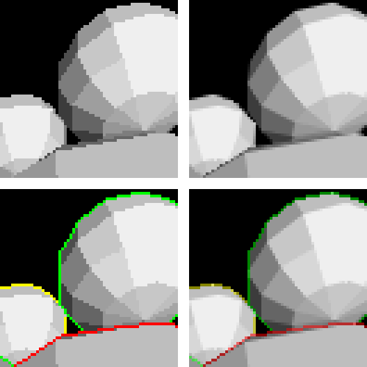

Something important to mention is that the clear plane has a polygon ID too. We
saw this when we talked about alpha blending, but it is also important here. If
a polygon doesn't have the same ID as the clear plane there will be an edge
around the screen border for that polygon:

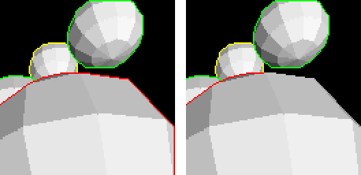

The code of the example can be found here:
[`examples/graphics_3d/antialiasing_and_edge_marking`](https://github.com/blocksds/sdk/tree/master/examples/graphics_3d/antialiasing_and_edge_marking)

## 18. GPU memory usage

As we saw in the introduction, there is a limit of 6144 vertices per frame. You
can draw up to 2048 triangles or 1536 quads in total. Any vertex or polygon
sent to the GPU after reaching that limit will be ignored.

Because of that, it can be useful to know how many polygons and vertices are
currently in the RAM of the GPU. It can be used to know when to optimize a
scene. You can do it like this:

```c
int polygons = 0;
int vertices = 0;
glGetInt(GL_GET_POLYGON_RAM_COUNT, &polygons);
glGetInt(GL_GET_VERTEX_RAM_COUNT, &vertices);
```

Another useful thing to know is the value of register `GFX_RDLINES_COUNT`. The
GPU draws the 3D scenes without a frame buffer. Instead, it has an internal
buffer of 48 lines that starts getting filled during the VBL period, so that
when the screen starts to be drawn there are up to 48 lines of 3D output to send
to the screen. On one side, the GPU works to fill this buffer until all 192
lines of 3D output are rendered. On the other side, the hardware that combines
2D and 3D gets one line from this buffer per scanline.

The problem is that rendering a line of 3D output can take longer than the time
it takes for the LCD to require another line. This happens if a horizontal
line has too many big polygons. If there are too many lines with too many big
polygons, the number of lines stored in the buffer can go down to 0.

When this happens, lines are taken out of the buffer even if they aren't
finished. This causes some polygons to appear half-drawn, with some polygons
missing (for example, the background may appear black, or objects may appear to
be missing some horizontal lines).

You don't need to read the `GFX_RDLINES_COUNT` register constantly to know if
there has been an underflow, you can use `GFX_CONTROL` instead. You can also use
it to see if there has been a polygon RAM overflow:

```c
// Check if there's an underflow in the rendered lines buffer
if (GFX_CONTROL & GL_COLOR_UNDERFLOW)
{
    // Print a warning in a debug log, for example.
}

// Check if there has been an overflow in the polygon RAM
if (GFX_CONTROL & GL_POLY_OVERFLOW)
{
    // Print a warning in a debug log, for example.
}

// Clear the error flags by writing 1 to them
GFX_CONTROL |= GL_COLOR_UNDERFLOW | GL_POLY_OVERFLOW;
```

## 19. Box test

One of the first things you will want to do when you start optimizing your 3D
rendering code is to avoid sending polygons to the GPU if they aren't going to
appear on the screen. Even if they don't take any time to be rendered, they
still need space in the GPU RAM, and they need processing time from the CPU and
GPU.

A very simple test you can use is the box test. The idea is to run a box test to
see if a certain object or area of your scene can be seen by the camera or not.
For example, if you have a character that fits in a 1x1x1 box you could do a box
test with a size of 1x1x1. If the box is visible, you send the character model
to the GPU. This can save you a lot of CPU time if you can organize your code to
do a few box tests and only draw what is actually shown on the screen. Of
course, you will still be sending some polygons that aren't visible, but this is
a simple way to optimize your code with minimal effort.

There are some requisites mentioned in [GBATEK](https://problemkaputt.de/gbatek.htm#ds3dtests).
You need to enable rendering of polygons that intersect with far plane and 1-dot
polygons behind `GFX_CUTOFF_DEPTH`:

```c
glPolyFmt(POLY_ALPHA(31) | POLY_CULL_NONE |
          POLY_RENDER_FAR_POLYS | POLY_RENDER_1DOT_POLYS);
// Update the polygon formats by using glBegin()
glBegin(GL_TRIANGLES);
glEnd();
```

This code can be used to check a box of size 1x1x1 centered around coordinates
(0, 0, 0). It goes from (-0.5, -0.5, -0.5) to (0.5, 0.5, 0.5):

```c
int in = BoxTestf(-0.5, -0.5, -0.5, // Position
                  1.0, 1.0, 1.0);   // Size

printf("Is box on screen? %s", in ? "Yes" : "No");

if (in)
{
    glPolyFmt(POLY_ALPHA(31) | POLY_CULL_NONE);

    draw_box(-0.5, -0.5, -0.5, // Position
             1.0, 1.0, 1.0);   // Size
}
```

The code of the example can be found here:
[`examples/graphics_3d/box_test`](https://github.com/blocksds/sdk/tree/master/examples/graphics_3d/box_test)

You can also use `BoxTestf_Asynch()` and `BoxTestResult()` if you want to do the
test asynchronously while doing other calculations.


According to [GBATEK](https://problemkaputt.de/gbatek.htm#ds3dtests), the box
test will return false if the whole box is inside the view volume of the camera.
The test only checks if the faces of the box are visible. If the box is too big,
the faces will be culled and it will return false. You need to use boxes small
enough to not fit inside the camera or add additional manual checks.


## 20. Position test

The position test lets you pass a vertex to the GPU and read the result of
transforming it by the currently active matrices.

Using it is very simple:

```c
PosTest(vertex.x, vertex.y, vertex.z);

int32_t x = PosTestXresult();
int32_t y = PosTestYresult();
int32_t z = PosTestZresult();
int32_t w = PosTestWresult();
```

You can also do this asynchronously like this:

```c
PosTest_Asynch(vertex.x, vertex.y, vertex.z);

// Do something here

while (PosTestBusy());

int32_t w = PosTestWresult();
```

The most useful way to use the result is to check the value of W to determine
the distance from the camera to the vertex. You can calculate the W value of
the center of several translucent objects to know the order in which you need to
draw them (from objects that are far away to objects that are close to the
camera). We've [already seen]()
an example that does this:

[`examples/graphics_3d/sort_translucent_objects`](https://github.com/blocksds/sdk/tree/master/examples/graphics_3d/sort_translucent_objects)

You could also use the W value as a debug value while you're setting up a fog
effect. You could move an object around the 3D scene while printing its W value
and use it as initial offset for the fog, for example.

You could even use the X and Y coordinates to check if the player is touching
the touch screen close to a specific object.


This chapter is a work in progress...

