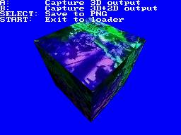

# Example of saving screenshots to PNG

This example uses the video capture hardware of the DS to capture the main
screen output, and then saves it to a PNG file in the SD card using
[LodePNG](https://lodev.org/lodepng/).

